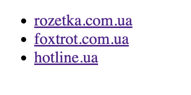
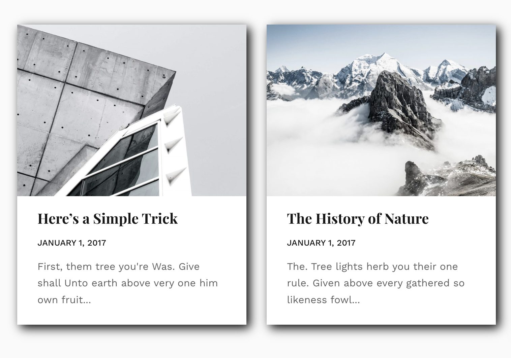

# Homework

## Блок 1

### Задание 1
Создать 2 маркированных списка:
* Первый должен содержать **li**, внутри которых будут имена строчных тегов изученных в
модуле.
* Второй должен содержать **li**, внутри которых будут имена блочных тегов изученных в
модуле.
* Используйте этот [ресурс](https://htmlreference.io/) для поиска и дополнительной справки по тегам.

### Задание 2
Сверстайте блок статьи состоящей из изображения, заголовка, абзаца и ссылки. Текст и
картинку возьмите любую

### Задание 3
Сверстать нумерованный список. В каждом элементе списка есть заголовок и абзац
текста. Для заполнения используйте текс-рыбу.

   

### Задание 4
Сверстать маркированный список, чтобы каждый элемент был ссылкой на интернет-магазин (достаточно 5-7 примеров).
При клике на ссылку, она открывается в новой вкладке браузера.

# Homework

## Блок 2
    В заданиях использовать семейство шрифтов Playfair Display , найти его на Google Fonts 
    и подключить. Оформление дополнительных заданий делать приблизительно
    похожее на изображение в задании, если таковое имеется. Важна 
    разметка + базовое испольование CSS-стилей.

### Задание 1
Изучить тему [css background](https://html5book.ru/css-background/).
### Задание 1

Сверстать горизонтальное меню из 6-ти пунктов. Оформить используя CSS. Меню должно быть 
центрировано на странице. Добавить пунктам меню любой эффект в состоянии **hover**, к примеру 
изменения цвета текста пункта меню.

### Задание 2
Сверстать статью с изображения. Ширина обертки для статьи **350px**. Отступы и поля
для контента сделать приближенными к изображению.

### Задание 3
Используя шаблон статьи из задания #2, создать еще одну статью с изображения. Ширина обертки для статей **720px**. 
Обертка должна быть центрирована на странице. Подставь статьи в одну строку внутри обертки.

   

### Задание 4
Вычислить и записать приоритет селекторов:
* **#myid:focus**
* **.menu > li > a:hover**
* **#myid > ul > li a:hover**   