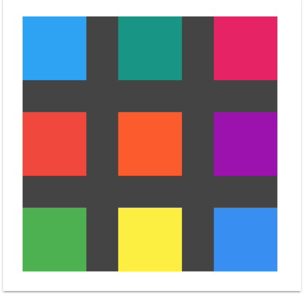
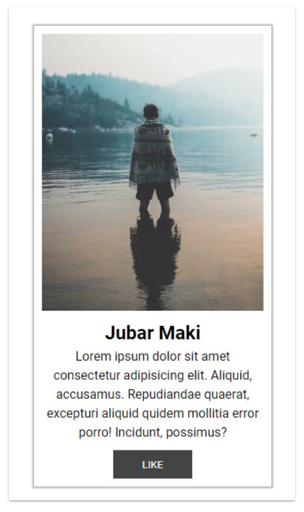
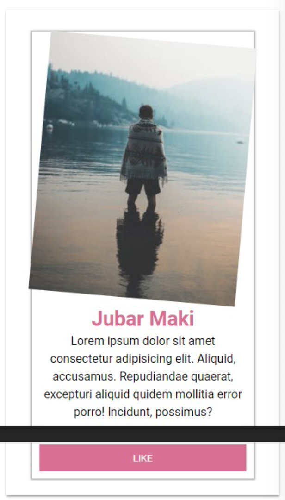
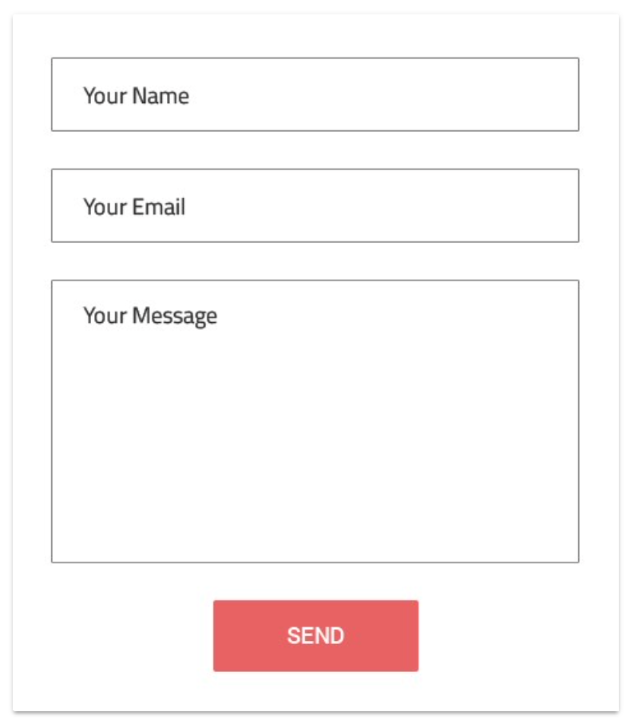
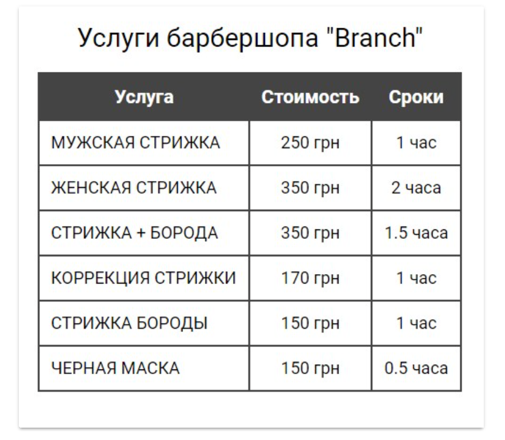
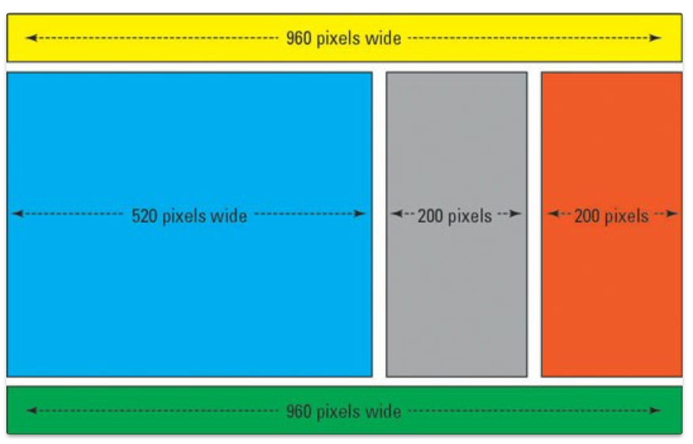
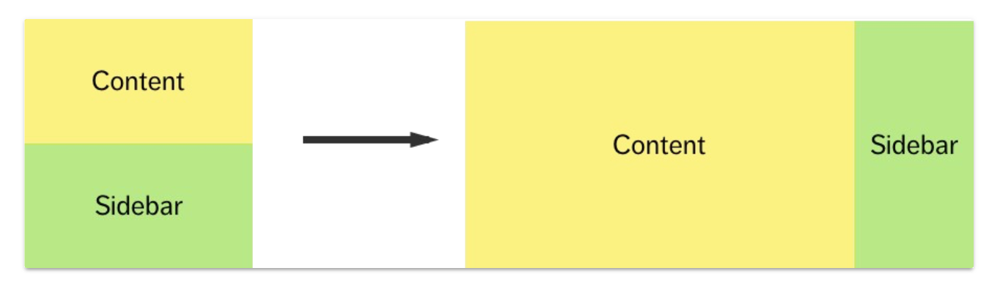
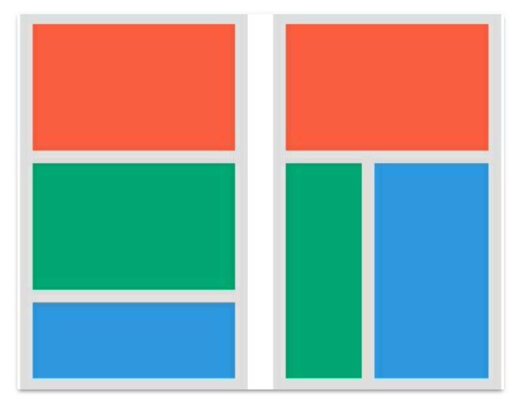

# Homework

1. CSS-градиент
2. CSS анимации

## Задание 1
Создать список из шести элементов. С помощью псевдокласса **hover** задать стили элементам меню при наведении курсора. 
Для создания горизонтального меню использовать **float**.

## Задание 2
Создать список из девяти элементов. Для элементов списка, с помощью псевдокласса **nth-child**, 
сделать 3 чередующихся фона #88292F, #5DB7DE и #0D5D56 . Цвет
шрифта должен быть **#0E1116**. 

## Задание 3
Создать список из девяти элементов. 
C помощью псевдоэлемента **::before** поставить перед каждой ссылкой символ [стрелки](https://www.toptal.com/designers/htmlarrows/arrows/right-arrow/).

## Задание 4

Сверстать блок размером на всю страницу, поставить на фон произвольное изображение. 
Используя технику множественного фона, добавить поверх картинки одноцветный линейный градиент с прозрачностью **rgba(0, 0, 0, 0.3)**.

## Задание 5
Сверстать блок размером 400x400 пикселей и фоном **#424242**. Добавить в него еще 9 блоков произвольных (но разных) 
цветов размерами **100x100** пикселей. Используя **абсолютное позиционирование**, спозиционировать 9 блоков относительно
родителя как указано на изображении.

## Задание 6*

Сверстать выпадающее меню, добавить произвольное оформление.

## Задание 7

Сверстать 3x3 галерею с изображениями используя Flexbox для расположения элементов галереи

## Задание 8

Сверстать карточку пользователя соцсети, оформление на свой вкус.
1. При наведении на саму карточку у нее изменяется размер тени, на произвольный по вашему вкусу.
2. При наведении на картинку, она совершает вращение на 5 градусов за 0.2секунды.
3. При наведении на заголовок, он увеличивается на 15% за 0.2 секунды и меняет цвет за 0.3
   секунды.
4. При наведении на кнопку, она увеличивается по ширине до 100% и изменяет цвет фона за 0.2 секунды.

## Задание 9

Сверстать форму с изображения

## Задание 10

Сверстать таблицу с изображения, использовать **caption** для заголовка

## Задание 11

Сделать резиновую верстку по указанному изображению. 
* Ширина контейнера - 960px 
* Все остальные ширины должны быть в процентах

## Задание 12

Используя медиаправила повторить расположение блоков на рисунке.
* 480px+ левая фигура 
* 768px+ правая фигура

## Задание 13

Используя медиаправила повторить расположение блоков на рисунке.
* 480px+ левая фигура
* 768px+ правая фигура

