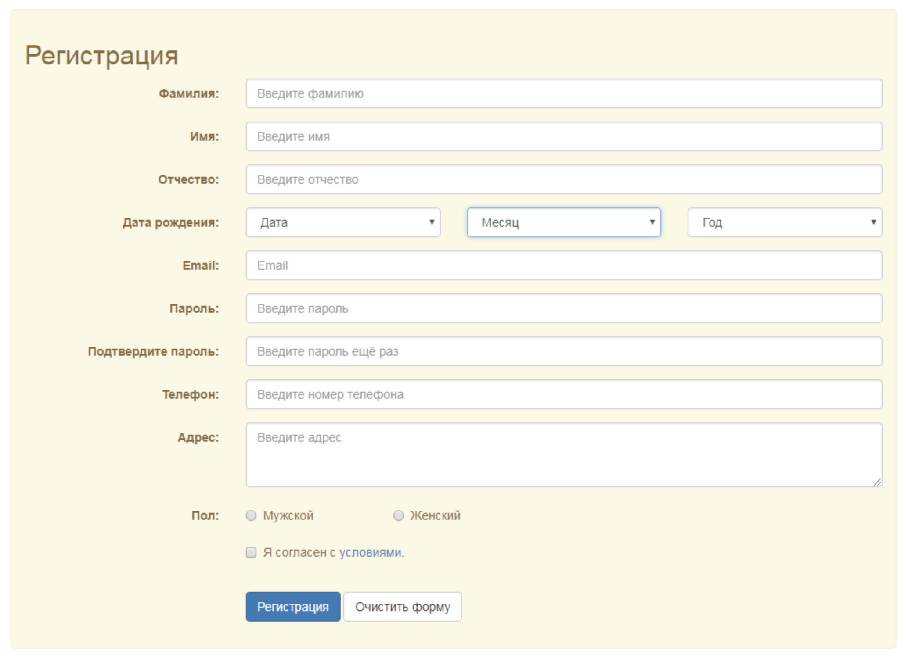

## Задание 1 
Сверстать форму, приближённую по дизайну к форме на картинке

<p align="center">

</p>

## Задание по блоку 2

1) ! Учить теорию !
2) Есть переменная name

Если в переменную вписана строка, то выводим в консоль сообщение "Привет, ЗНАЧНИЕ_NAME"
Если в переменную вписана не строка, а любой другой тип данных, то выводим сообщение "Ошибка, не тот тип данных"


Кейс 1

  ```
  const name = 'Vasya';
 
  console.log(.....)  // Hello Vasya 
  ```

Кейс 2

  ```
  const name = 123;
 
  console.log(.....)  // Ошибка, не тот тип данных
  ```

3) Вывести в консоль примеры всех типов данных

  ```
  typeof (1); // number
  typeof ('a'); // string
  
  ```


## Задание по блоку 3

1. Есть массив ['Капуста', 'Репа', 'Редиска', 'Морковка']. Надо вывести в консоль строку 'Капуста | Репа | Редиска | Морковка';


2. Есть строка 'Вася;Петя;Вова;Олег'. Используя стандартные методы строк получить массив их имен;

```
const newArr = .....; // ["Вася", "Петя", "Вова", "Олег"]
```


3. Напишите функцию hello2(), которая при вызове будет принимать переменную (в аргументы) name (например, «Василий») и выводить строку (в нашем случае «Привет, Василий»).
В случае отсутствующего аргумента выводить «Привет, гость»


4. Есть массив ['яблоко', 'ананас', 'груша']
Привести каждый элемент массива в верхний регистр (сделать все слово большими буквами) и получить результат (новый массив) в новую переменную.

```
const fruits = ['яблоко', 'ананас', 'груша'];
const fruitsInUpperCase = ....; // тут должен быть массив, в котором ['ЯБЛОКО', 'АНАНАС', 'ГРУША']
```


5. Написать функцию addOneForAll, которая может принять **неограниченное** кол-во аргументов. Добавить к каждому 
аргументу 1 и вернуть новый массив с новыми значениями.

    Пример:

   * передал в массив такие числа - 1, 2, 3, 4

   * функция добавляет к каждому числу + 1

   * функция возвращает новый массив, в котором новые значения

```
const val = addOneForAll(1, 2, 3, 4);
console.log(val); [2, 3, 4, 5]
```


6. Написать функцию getSum, которая может принять **неограниченное** кол-во аргументов и возвращает их сумму.

```
const val = getSum(1, 2, 3, 4);
console.log(val); // 10
```

7. Есть массив [1, 'hello', 2, 3, 4, '5', '6', 7, null]. Отфильтровать массив так, чтобы остались только числа. Сделать можно любым способом из того, что учили.

```
const arr = [1, 'hello', 2, 3, 4, '5', '6', 7, null];
const numberArray = ....; // [1, 2, 3, 4, 7];
```

8. Написать функцию arrayTesting, которая принимает в себя любой массив (в аргументы).
Функция проверяет есть ли в массиве хоть одно true значение и если оно есть, то возвращаем из функции строку 'Нашли true значение', если его нет - 'Ничего нет'

```
const haveTrueValue = arrayTesting([0, false, null, 1]); // Нашли true значение (потому что есть хотябы одно true значение - 1)
const dontHaveTrueValue = arrayTesting([0, false, null, 0]); // Ничего нет
```