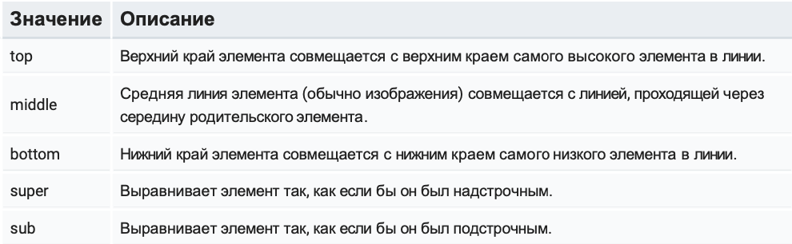

# Lesson 1
## Introduction

## План
**Блок 1**
1. [Введение](#Введение) 
2. [Среда разработки](#dev-environment)
3. [HTML](#HTML)
4. [Теги](#Теги)
5. [Атрибуты тегов](#Атрибуты тегов)
6. [Обзор основных тегов](#Обзор основных тегов)
7. [Блочные и строчные элементы](#Блочные и строчные элементы)
8. [Абсолютные и относительные пути](#Абсолютные и относительные пути)
9. [Символьные подстановки](#Символьные подстановки)
10. [Правила оформления кода](#Правила оформления кода)

**Блок 2**

1. [О CSS в целом](#О CSS в целом)
2. [Синтаксис](#Синтаксис)
3. [Виды таблицы стилей](#Виды таблицы стилей)
4. [Виды селекторов](#Виды селекторов)
5. [Группировка селекторов](#Группировка селекторов)
6. [Наследование, каскад, специфичность](#Наследование, каскад, специфичность)
7. [Модель визуального форматирования](#Модель визуального форматирования)
8. [Блочные и строчные элементы](#Блочные и строчные элементы)
9. [Особенности margin](#Особенности margin)
10. [Выравнивание контента](#Выравнивание контента)
11. [Оформление текста](#Оформление текста)

**Блок 3**

## Введение
Веб-сайты это основа на которой держится интернет. Большинство веб-сайтов
создается используя три технологии:

* __HTML__ - отвечает за наполнение веб-страницы контентом, структурирование информации и
  выделение логических блоков веб-страницы.

* __CSS__ - используется для оформления и позиционирования, представления информации на странице.

* __JavaScript__ - используется для добавления функционала, интерактивного
  взаимодействия с пользователем.

<h2 id='dev-environment'>Среда разработки</h2>
В качестве среды разработки Вы можете использовать любой удобный редактор кода. Я использую [VSCode](https://code.visualstudio.com/),
а так же плагины:

- LiveServer - для удобной вёрcтки и разработки.
- Prettier - для форматирования JavaScript

## HTML

**HyperText Markup Language** (язык разметки гипертекста) — стандартизированный язык разметки
документов во Всемирной паутине. Это набор правил, которые используются для структурирования (разметки) текстовой
информации, добавления внешних изображений, создания таблиц, списков и т.д.

**HTML-документ** — это обычный текстовый документ, который имеет расширение _.html_ . Документ, размеченный с помощью
HTML, интерпретируется браузером, в результате чего, пользователи видят не исходный код с элементами разметки, а
итоговый результат обработки HTML-документа.

### W3C

Популярность языка разметки HTML и использование его в качестве основы сети Интернет, привело к
необходимости управления стандартами HTML. World Wide Web Consortium, или сокращенно [W3C](https://www.w3.org/) -
организация, которая занимается развитием HTML и его стандартов.

### Спецификация HTML
Спецификация HTML — основополагающий, главный документ, описывающий
возможности и стандарты языка HTML. Для нас важны следующие разделы, они описывают как теги можно вкладывать друг в
друга и что обозначает каждый тег:

- [Семантика элементов](https://www.w3.org/TR/html53/dom.html#elements-semantics)
- [Типы контента](https://www.w3.org/TR/html53/dom.html#kinds-of-content)
- [HTML-элементы](https://www.w3.org/TR/html53/semantics.html#semantics)

### Категории контента
Выделяют 7 категорий контента. Запоминать их сейчас не нужно, но познакомиться, для
лучшего понимания возможностей HTML, стоит:
- **Metadata content** - метаданные для браузеров, поисковиков и так далее (всё, что в
  **head**, служебная информация).
- **Flow content** - потоковый контент (всё, что в **body**, то что увидит пользователь).
- **Sectioning content** - крупные смысловые разделы документа.
- **Heading content** - заголовки.
- **Phrasing content** - фразовый контент, сам текст документа и мелкие текстовые элементы, которые мельче абзаца.
- **Embedded content** - встраиваемый контент (изображения, видео, аудио и так далее). Interactive content - интерактивные элементы, то, с чем взаимодействует
  пользователь.

## Теги
Основой HTML являются теги, которые создают различные элементы, задающие
содержание и структуру итогового документа.

**Тег (tag, именованная метка, дескриптор)** — элемент языка разметки гипертекста. Контент, содержащийся между начальным
и конечным тегом, отображается и размещается в соответствии со свойствами, указанными в начальном теге. Для выделения
тегов среди остального текста документа, используются специальные символы - угловые скобки (angle brackets).
HTML-документ состоит из дерева HTML-элементов и текста. Каждый элемент обозначается в исходном документе открывающим и
закрывающим тегом (за редким исключением).

    <имя‐тега>...</имя‐тега>

Открывающий тег показывает, где начинается элемент, закрывающий — где заканчивается. Закрывающий тег образуется путем
добавления слэша / перед именем тега. Между открывающим и закрывающим тегами находится содержимое тега — контент.
Теги могут вкладываться друг в друга, например. При вложении следует соблюдать порядок их закрытия (принцип «матрёшки»).

    <тег‐1> 
        <тег‐2>
            <тег‐3>...</тег‐3>
            <тег‐4>...</тег‐4> 
        </тег‐2>
    </тег‐1>

Теги можно разделить на две категории:
* **Парные теги** - теги, состоящие из открывающего тега (например \
 ) и закрывающего тега ( \
 ).
  Парные теги оборачивают контент, позволяя изменять его свойства или вид отображения. Внутри парных тегов могут
  присутствовать другие теги.
* **Одиночные теги** - теги состоящие только из открывающего тега (например \ ). Одиночные теги создают один
  элемент на странице, либо служат для изменения свойств документа, подключения файлов и т.д. Они получают свой контент
  или поведение из атрибутов.

Существует множество тегов которые служат для описания основных элементов веб страницы и их визуального оформления,
условно теги делятся на следующие типы:
* Теги верхнего уровня
* Теги заголовка документа
* Теги общего назначения

### Теги верхнего уровня
Эти теги предназначены для формирования структуры веб-страницы и определяют
раздел заголовка и тела документа.
**html** — корневой элемент документа, как контейнер который заключает в себе всё
содержимое веб-страницы, включая теги head и body.

**head** — предназначен для хранения технической информации о странице: заголовок, описание, ключевые слова для поисковых
машин, кодировку и т.д. Вся эта информация не отображается в окне браузера, однако содержит данные, которые указывают
браузеру, как следует обрабатывать страницу.

**body** — предназначен для хранения содержания веб-страницы, отображаемого в окне браузера. Контент, который должен
отображаться на странице, следует располагать именно внутри контейнера body. К такому контенту относятся текст,
изображения, таблицы, списки и др.

В примере приведен набор тегов верхнего уровня и порядок их вложенности. Это основа любого HTML-документа, как фундамент для дома.

    <!DOCTYPE html> 
    <html>
        <head>
        ...
        </head>
        <body>
        ... 
        </body>
    </html>

### Теги заголовка документа
К этим тегам относятся элементы, которые располагаются в **head**.
Они напрямую не отображаются в окне браузера, за исключением тега **title**,
который определяет название веб-страницы.

#### Title
Обязательный тег. Текст, размещенный внутри него, отображается в строке заголовка веб-браузера.
Длина заголовка должна быть не более 60 символов, чтобы полностью поместиться в заголовке. Текст заголовка должен
содержать максимально полное описание содержимого веб-страницы.

#### meta
Используются для хранения информации, предназначенной для браузеров и поисковых систем - установки кодировки документа,
для передачи информации поисковым системам, для установки ширины и начального масштаба для окна просмотра на мобильных
устройствах и многое другое. Например, механизмы поисковых систем обращаются к метатегам для получения описания сайта,
ключевых слов и других данных.
Примеры метатегов:

    <meta charset="UTF-8">
    <meta name="author" content="A-Level">
    <meta name="keywords" content="HTML, тег, метатег">
    <meta name="description" content="Страница о тегах">

## Атрибуты тегов
Атрибуты позволяют изменять свойства и поведение элемента, для которого они заданы. Общее количество атрибутов
достаточно велико, но их значения, как правило, можно сгруппировать по разным типам, например, задающих размер, адрес
и др.

Атрибуты записываются внутри открывающего тега, а их значения располагаются внутри кавычек. Атрибутов может быть
несколько. Некоторые теги не могут использоваться без атрибутов.
Атрибуты тега **a** :
* **href** — указывает адрес на ту страницу, на которую перейдет пользователь при нажатии на текст ссылки
* **target** — указывает то, в каком окне откроется новая страница title — добавляет всплывающую подсказку к тексту ссылки

Атрибуты тега **img**:
* **src** — указывает на адрес изображения
* **alt** — указывает альтернативный текст, который будет показан, если картинка, по какой-то причине не загрузилась
* **width** и **height** — задают ширину и высоту изображения

Все возможные аттрибуты для каждого тега можно посмотреть кликнув на [линку](http://htmlreference.io/)
или просто воспользоваться поисковиком.

## Обзор основных тегов
HTML-документ должен иметь смысл, как страница из газеты, на ней есть секции, заголовки, списки, изображения, абзацы
текст и т.д. Для всего этого богатства типов контента есть соответствующие теги, которые несут в себе смысл, тем самым
описывая контент. Давайте разберем основные из них.

### Большие смысловые разделы
* **article** — независимая, отделяемая, и имеющая значение вне, часть документа,
  например твит, статья, виджет с рекламой. Желателен заголовок.
* **section** — смысловой раздел документа. Неотделяемый от основного документа, в
  отличие от article. Желателен заголовок.
* **nav** — навигационный раздел со ссылками на другие страницы или другие части
  страниц. Используйте для основной навигации, а не для всех групп ссылок в документе.

### Заголовки \<h1>...\<h6>
Эта группа тегов определяет текстовые заголовки смысловых разделов разного уровня, которые показывают относительную
важность секции, расположенной после заголовка.

Должны использоваться только для выделения заголовков нового раздела или подраздела.
При использовании заголовков необходимо учитывать их иерархию, т.е. за **h1** должен следовать **h2** и т.д.
Обратите внимание, что тег **h1** используется только один раз, как основной заголовок страницы.
На главных страницах не всегда рисуют заголовок первого уровня. **h2** - **h6**, однако, могут использоваться сколько
угодно, но их всегда следует использовать по порядку, указывая важность и иерархию заголовков контента. Например, **h4**
должен быть подзаголовком **h3**, который должен быть подзаголовком **h2**.
### Потоковое содержимое

* **header** — вводная часть смыслового раздела или всего сайта, обычно содержит подсказки и навигацию.
  Часто используется как шапка всей страницы или сложной секции. Может быть несколько на странице.
* **main** — основное, не повторяющееся на других страницах, содержание. Может быть только один на
  странице.
* **footer** — финальная часть раздела или всего сайта, часто содержит копирайт, список ссылок на
  социальные сети, контактную информацию и так далее. Может быть несколько на странице.

### Списки

Списки предоставляют возможность упорядочить и систематизировать коллекции и представить их в наглядном и удобном для
пользователя виде. Каждый список представляет собой контейнер, внутри которого располагаются элементы списка.
* **ol** — создает нумерованный список, т.е. каждый элемент списка начинается с числа. Браузер нумерует элементы по
  порядку автоматически и если удалить один или несколько элементов такого списка, то остальные номера будут
  автоматически пересчитаны.
* **ul** — создает маркированный список, каждый элемент которого начинается с небольшого символа — маркера.
* **li** — определяет отдельный элемент списка.

### Параграф
**Параграф** — универсальный контейнер для группировки мелких фразовых элементов, отделения их друг от друга, и дальнейшей
стилизации. Используется не только для указания параграфов, это скорее структурный тег, нежели смысловой.
Часто необходимо заполнить тег текстом, когда самого текста, который будет размещаться на сайте ещё нет. Для того чтобы
текст для заполнения был похожим на реальный используют специальный заполнитель. Это набор слов, пришедший из типографии
(текст-рыба).
### Универсальный блочный контейнер
В то время как большинство HTML-тегов определяют значение (**section** выделяет секцию, **h1** создает заголовок и т. д.),
тег **div** вообще не имеет никакого семантического значения.

Это может звучать странно, но они фактически используются для группировки тегов для последующей стилизации. До HTML5,
**div** использовался для группировки логически связанного контента, теперь же у нас есть семантические теги.
Тег **div** относится к универсальным блочным контейнерам и применяется в тех случаях, где нужны блочные элементы без
дополнительных свойств. В большинстве ситуаций используется как блок-обертка, с последующей стилизацией.
Как определить, перед нами **article** или **div** ?
* Если мы можем дать имя разделу и вынести этот раздел вне нашего сайта и он будет иметь смысл - это article .
* Если мы можем дать имя разделу и, но вне нашего сайта этот раздел не будет иметь смысла - это section .
* Если же мы не можем дать вменяемого имени группе контента (не "правая колонка", а имеющее смысл) - это div и скорее
  всего нам просто нужна группировка для стилизации.

### Фразовый контент
#### Ссылка
Якорь — предназначен для создания ссылок. Внутрь тега a помещается текст, который будет отображаться на веб-странице.
Текст ссылки отображается в браузере с подчёркиванием, цвет шрифта — синий, при наведении на ссылку курсор мыши меняет вид.

Атрибуты:
* **href** — обязательным атрибут, задает адрес веб-страницы или некого ресурса (может содержать как абсолютный, так
  и относительный путь).
* **download="file_path"** — сообщает браузеру, что указанный в **href** ресурс должен быть загружен в момент, когда
  пользователь щелкает по ссылке. Задавая имя для атрибута, мы таким образом задаем имя загружаемому файлу.
  Можно использовать атрибут без указания его значения.
* **target** — указывает на то, в каком окне должен открываться документ, к которому ведет ссылка. Интересным значением
  можно выделить **_blank**, при котором страница открывается в новом окне браузера.
* **rel** — дополняет атрибут **href** информацией об отношении между текущим и связанным документом.

У ссылок есть возможность не только переходить на другие страницы и скачивать файлы, но и совершать звонки на телефоны,
отправлять сообщения или звонить по скайпу.

#### Контентное изображение
Использование графики делает веб-страницы визуально привлекательнее. Изображения помогают лучше передать суть и
содержание документа. Тег img предназначен для отображения на веб-странице изображений в различных графических форматах.
Не все изображения на странице контентные, некоторые фоновые, об это в следующих модулях.

Атрибуты:
* **src** — обязательный и указывает браузеру, где можно найти изображение. Как и тег **a**,
  путь к картинке может быть абсолютным, или относительным.
* **alt** — является альтернативным описанием. Это необходимо для предоставления значимой информации для пользователей, которые не могут видеть изображение (например, если они слабовидящие), или если картинка попросту не загрузилась.
* **width** — задает ширину изображения.
* **height** — задает высоту изображения.

#### Кнопка
Часто тег **button** это просто интерактивный элемент, который «оживляется» с помощью JavaScript. Например, кнопка
закрытия всплывающего окна или прокрутки карусели.

Важно не путать ссылку и кнопку. Если при клике в элемент интерфейса происходит переход по какому-то адресу,
то есть у ссылки есть **href**, то это ссылка. Если же при клике происходит что-то без перезагрузки или перенаправления
страницы, то это кнопка.
#### span
В отличие от абзаца, **span** не начинается с новой строки. Он строчный, подчиняется правилу потока документа "слева
направо" и занимает ширину по своему контенту. Предназначен для определения строчного элемента внутри документа, не
заменяет тег **p**. Может использоваться для группировки и выделения строчного контента внутри абзаца для дальнейшей
стилизации.

## Блочные и строчные элементы
**Поток документа** - порядок расположения элементов на странице. Поток документа относится не к смысловой составляющей
страницы, а к ее внешнему виду (расположение элементов).
Есть набор правил, которым подчиняются все элементы находящиеся в потоке документа:
* Вертикально поток документа протекает сверху вниз. По умолчанию, чем раньше в коде расположен тег, тем выше он
  расположен на странице. То есть по умолчанию, элементы будут находиться на странице в том порядке, в котором они указаны
  в HTML-документе.
* Горизонтально поток документа протекает слева направо (или справа налево, для восточных стран). Элементы занимают так
  называемые строки, как буквы на листе в линейку. В строке элементы располагаются слева направо (по умолчанию), когда
  ширины строки не хватает для вмещения содержимого элемента, происходит перенос на следующую строку.

**Блочные элементы** — характеризуются тем, что занимают всю доступную ширину внутри блока-родителя, высота элемента
определяется его содержимым (если явно не указана), и он всегда начинается с новой строки. Визуально это прямоугольные
области, идущие друг за другом сверху вниз.

**Строчные элементы** — элементы веб-страницы, которые являются непосредственной частью другого элемента, например,
текстового абзаца. В основном они используются для изменения вида текста или его логического выделения. Занимают по ширине и
высоте размеры по своему контенту и будут выстраиваться в одну строку до тех пор, пока в строке хватит места,
после чего начнут перепрыгивать на следующую и заполнять ее.

## Абсолютные и относительные пути
**Абсолютный путь** - Указывает точное местоположение файла в структуре папок в проекте или на сервере. Абсолютный путь к
файлу позволяет получить доступ к файлу со сторонних ресурсов и выглядит следующим
образом: https://www.president.gov.ua/images/emblem.svg

**Относительный путь** - описывает путь к указанному документу относительно текущего. Примеры:
* / - указывает на корневую папку, к примеру /img/smile.png
* ./ - указывает на текущую папку, к примеру ./img/smile.png
* ../ - подняться на одну папку выше, к примеру ../img/smile.png

## Символьные подстановки
Во время верстки можно забыть об одной важной специфике HTML которая ведет к ошибкам разметки. Использование в тексте
символов < , / и " , которые могут быть восприняты браузером как управляющие структуры, это спецсимволы (знаки больше
и меньше, слеши, кавычки и т.д.).

Спецсимволы чувствительны к регистру, поэтому их необходимо прописывать точно так, как указано в таблице. Спецсимволы,
не имеющие мнемоники, могут не отображаться вовсе или же некорректно отображаться в тех или иных браузерах.
При использовании данных символов в тексте документа, браузер может посчитать их частью тегов и закрыть либо сгенерировать тег, которого нет в коде, что приводит к ошибкам в верстке. Чтобы этого избежать спецсимволы вставляют в HTML в виде набора кодов. Различают три варианта добавления символов:
* **&мнемокод;** – наиболее прост в запоминании (например - ©)
* **&#КОД10;** - вставка спецсимвола с помощью десятеричного кода ( пример - &)
* **&#КОД16;** - вставка спецсимвола с помощью шестнадцатеричного кода ( пример - ®)

Как видно, все последовательности начинаются с символа & (амперсанд) и заканчиваются символом ; (точка с запятой).
Примеры можно посмотреть [тут](https://www.toptal.com/designers/htmlarrows/).
## Правила оформления кода

Оформление HTML и CSS документов - это важный вопрос. В первую очередь, важный для разработчика. Ведь в процессе работы
над созданием веб-ресурсов достаточно часто необходимо возвращаться к уже написанному коду. В подавляющем большинстве
проектов больше чем 1 разработчик. А если код не оформлен - он теряет читабельность и, как следствие, скорость разработки
падает.

В качестве примера можно изучить данный [ресурс](http://sadcitizen.me/code-guide/).

**Блок 2**

## CSS

## О CSS в целом
**CSS (Cascading Style Sheets)** - каскадные таблицы стилей, это язык, используемый для
описания оформления документа, написанного языком разметки, таким как HTML.

В то время как HTML используется для определения структуры и семантики содержимого документа, CSS используется для 
его стилизации и позиционирования. Каскадные таблицы стилей описывают правила форматирования элементов с помощью 
свойств и допустимых значений этих свойств. Для каждого элемента можно использовать ограниченный набор свойств, 
остальные свойства не будут оказывать на него никакого влияния.

## Синтаксис
Синтаксис CSS очень простой, объявление стиля состоит из двух частей: элемента веб-страницы — селектора и команды 
форматирования — блока объявления. Вначале пишется имя селектора, например body, это означает, что все стилевые 
параметры будут применяться к тегу **body**, затем идут фигурные скобки, в которых записывается стилевое свойство, 
а его значение указывается после двоеточия.

**CSS правило** - это конструкция, которая связывает 1 или более селекторов с одним или более свойств CSS.

**Селектор (selector)** - указывая его, мы говорим браузеру, к чему именно хотим применить css правило (html-тег, id, 
класс и т.д.).

**Блок объявлений (declaration block)** - так называется всё содержимое, находящееся между фигурными скобками после 
селектора.

**Свойство (property)** - идентификатор действия, которое будет применено к элементу (например, вы хотите изменить 
начертание шрифта font-weight, цвет color, размер шрифта font-size и т. д.). После имени свойства необходимо 
ставить двоеточие.

**Значение (value)** - описывает, как именно свойство будет обработано браузером. Каждое свойство имеет набор допустимых 
значений, определенных формальными правилами, а также семантический смысл, реализованный движком браузера. Записывается 
после двоеточия.

## Виды таблицы стилей

### Встроенные стили

Стили прописываются непосредственно в атрибуте **style** самого тега элемента, к которому мы хотим их применить.

### Внутренние стили

Стили прописываются в теге **style**, который размещается в **head**.

### Внешняя таблица стили

Внешняя таблица стилей описывается во внешнем файле с расширением **.css**, после чего он подключается к документу, 
используя тег **link**. Внутри файла могут содержаться только стили. К каждой веб-странице можно присоединить несколько 
таблиц стилей, добавляя последовательно несколько тегов **link**. На сегодняшний день это стандарт подключения стилей к
документу.

Обычно этот процесс выглядит вот так:
* На одном уровне с index.html создается папка css.
* Внутри папки css создается файл стилей, к примеру, styles.css
* В теге head, используя тег link, подключаем созданный ранее файл стилей. В атрибут href тега link значением 
записываем путь к файлу стилей, относительно index.html

      <head>
        <link rel="stylesheet" href="css/styles.css">
      </head>

## Виды селекторов

Селекторы представляют структуру веб-страницы. С их помощью создаются правила для форматирования элементов веб-страницы.
Селекторами могут быть элементы, их классы и идентификаторы, а также псевдоклассы и псевдоэлементы.

**Универсальный селектор** - соответствует любому HTML-элементу

**Селектор элемента** - описывает, к какому типу элемента будет применено css правило, после чего свойства будут 
применены ко всем элемента данного типа.

**Селектор класса** - тегам можно задать специальный атрибут **class**. После чего мы можем использовать селектор класса, 
чтобы задавать стили для одного и более элементов с одинаковым именем класса, размещенных в разных местах страницы. В CSS 
перед именем класса ставится точка.

**Селектор идентификатора** - как и с классом, тегам можно задавать атрибут **id**. Отличие в том, что **id** должен быть 
уникальным на странице, это значит, что селектор **id** позволяет форматировать один конкретный элемент. В CSS перед 
идентификатором ставится решетка #

**Селектор потомка** - применяет стили к элементам, расположенным внутри элемента-контейнера. 
Если нужно отформатировать потомки определенного элемента, этому элементу нужно задать стилевой класс.

**Дочерний селектор** - дочерний элемент является прямым потомком содержащего его элемента. У одного элемента может 
быть несколько дочерних элементов, а родительский элемент у каждого элемента может быть только один. Дочерний селектор 
позволяет применить стили только, если дочерний элемент идёт сразу за родительским элементом, и между ними нет других 
элементов, то есть дочерний элемент больше ни во что не вложен.

**Сестринский селектор** - сестринские отношения возникают между элементами, имеющими общего родителя. Селекторы 
сестринских элементов позволяют выбрать элементы из группы элементов одного уровня.

**Селектор атрибута** - выбирает элементы на основе имени атрибута или значения атрибута.

**Селектор псевдокласса** - псевдоклассы это состояния элемента. Они позволяют применить CSS-правила к элементам 
при совершении события или подчиняющимся определенному правилу.

## Группировка селекторов

Один и тот же стиль можно одновременно применить к нескольким элементам. Для этого необходимо перечислить через 
запятую нужные селекторы

## Наследование, каскад, специфичность

**Наследование и каскад** — два важных понятия в CSS, которые тесно связаны. Наследование заключается в том, что элементы 
наследуют свойства от содержащего их элемента (родителя). Каскад проявляется в том, как разные виды таблиц стилей 
применяются к документу, и как конфликтующие правила переопределяют друг друга.

### Наследование

Наследование является механизмом, с помощью которого определенные свойства передаются от предка к его потомкам. 
Спецификацией CSS предусмотрено наследование свойств, относящихся к текстовому содержимому страницы, таких как color, 
font, text-align и т.д. Во многих случаях это удобно, так как не нужно задавать размер шрифта и семейство шрифтов для 
каждого элемента веб-страницы.

* Стили могут наследоваться от родительского элемента.
* Стили, расположенные в таблице стилей ниже, отменяют стили, расположенные в таблице
выше.
* К одному элементу могут применяться стили из разных источников. Проверить, какие стили
применяются, можно в инструментах разработчика.
* При определении стиля можно использовать любую комбинацию селекторов — селектор
элемента, псевдокласса элемента, класса или идентификатора элемента.

### Каскад

Каскадирование — это механизм, который управляет конечным результатом в ситуации, когда к одному элементу 
применяются разные CSS-правила. Существует три критерия, которые определяют порядок применения свойств —
правило **!important**, специфичность и порядок, в котором подключены таблицы стилей.

* К одному и тому же элементу может примениться несколько CSS-правил. В этом случае свойства правил комбинируются.
* Свойства элемента можно комбинировать и явно с помощью множественных классов. 
* Когда в разных CSS-правилах есть одинаковые свойства с разными значениями, то они конфликтуют.

#### !important

**Внимание!** 

Использовать не рекомендуется :).

**Спасибо за внимание**

Вес правила можно задать с помощью ключевого слова **!important**, которое добавляется сразу после значения свойства. 
Правило необходимо размещать в конец объявления перед закрывающей скобкой, без пробела. Такое объявление будет иметь 
приоритет над всеми остальными правилами. Это правило позволяет отменить значение свойства и установить новое для 
элемента из группы элементов в случае, когда нет прямого доступа к файлу со стилями.

### Специфичность

Для каждого правила браузер вычисляет специфичность селектора, и если у элемента имеются конфликтующие объявления 
свойств, во внимание принимается правило, имеющее наибольшую специфичность. Значение специфичности состоит из четырех 
частей: 0, 0, 0, 0. В результате к элементу применятся те правила, специфичность которых больше.

* Специфичность определяется по селектору.
* Если специфичность одинаковая, то побеждает, то правило, которое расположено ниже в
коде.
* Чем проще селекторы, тем меньше проблем с расчётом специфичности.

Специфичность селектора определяется следующим образом:
* каждый **встроенный стиль**, добавляет единицу в первый разряд — **1, 0, 0, 0**
* каждый **id** добавляет единицу во второй разряд - **0, 1, 0, 0**
* каждый **class**, **атрибут**, **псевдокласс** добавляет единицу в третий разряд - **0, 0, 1, 0 **
* каждый **элемент** и **псевдоэлемент** добавляет единицу в четвертый разряд - **0, 0, 0, 1**

Вот [тут](https://habr.com/ru/post/137588/) есть хороший разбор этой темы. Рекомендую.

## Модель визуального форматирования

Модель визуального форматирования CSS представляет собой алгоритм, который обрабатывает HTML-документ и выводит его на 
экран устройства. Данная модель преобразует каждый элемент документа таким образом, что он генерирует ноль или более 
прямоугольных боксов в соответствии с блочной моделью CSS

### Блочная модель

В блочной модели элемент рассматривается как прямоугольный контейнер, имеющий область содержимого и необязательные поля,
рамки и отступы. Свойство **display** определяет тип контейнера элемента. Для каждого элемента существует значение
браузера по умолчанию.

**Область содержимого (content)** — это содержимое элемента, например, текст или изображение.

**Внутреннее поле (padding)** — это расстояние между основным содержимым и его границей (border). 
Если для элемента задать фон, то он распространится также и на поля элемента. Внутренний отступ не может 
принимать отрицательных значений.

**Внешний отступ (margin)** - добавляет отступ снаружи элемента от внешней границы рамки (border) до соседних элементов,
тем самым разделяя элементы на странице. Внешние отступы всегда остаются прозрачными и через них виден фон родительского
элемента. Может принимать отрицательное значение. Не обязателен, по умолчанию значение равно нулю.

**Граница, или рамка (border)** - если цвет рамки не задан, она принимает цвет основного содержимого элемента, например,
текста. Если рамка имеет разрывы, то сквозь них будет проступать фон элемента. Не обязателен, по умолчанию значение 
равно нулю.

### Подвиды блочной модели

Существует несколько блочных моделей. Они отличаются расчетом финального
размера блока. Для изменения модели используется свойство **box-sizing**.

#### Content box

**content-box** включена в браузерах по умолчанию, "контринтуитивна". Поставив ширину 100px, padding 20px и border 10px, 
мы получим 100px ширину content area плюс по 20px padding(левый и правый) и по 10px border (левый и правый), 
итого полная ширина будет равна 100+20+20+10+10 = 160px. Хотя ширину блока мы указали 100px. Аналогично рассчитывается 
высота.

#### Border box

В отличие от **content-box**, при **border-box** _width_ и _height_ описывают финальные, желаемые размеры блока, 
а не контентной области. Контентная область как-бы сжимается чтобы "внутри" блока еще вместился padding и border.

## Блочные и строчные элементы

### Блочные элементы

**Блочные элементы (display: block)** — элементы, которые форматируются визуально как блоки, располагаясь на странице в 
окне браузера вертикально. Они создают разрыв строки перед элементом и после него, образуя прямоугольную область, 
по ширине занимающую всю ширину веб-страницы или блока-родителя (если для элемента не задано значение width). 
Это элементы div, h1-h6, p, ol, ul, li и многие другие.

### Строчные элементы

**Строчные (display: inline)** - элементы, которые генерируют внутристрочные контейнеры.
Они не формируют новые блоки контента.

Они игнорируют верхние и нижние margin и padding, но если для элемента задан фон, он
будет распространяться на верхний и нижний padding, заходя на соседние строки текста.

Ширина и высота строчного элемента зависит только от его содержимого, задать размеры 
с помощью CSS нельзя. Можно увеличить расстояние между соседними элементами по горизонтали с 
помощью горизонтальных полей и отступов.

### Строчно-блочные элементы

**Cтрочно-блочные (display: inline-block)** - такие элементы являются встроенным, но
для них можно задавать поля, отступы, ширину и высоту.

Для того чтобы верхние и нижние поля и отступы работали для строчного элемента, нужно использовать 
display: inline-block. Элемент останется строчным, но к нему можно будет полноценно применить поля, 
отступы, задать ширину и высоту.

### Преобразование типов элементов

В некоторых случаях бывает необходимо, чтобы строчный элемент вел себя как блочный и наоборот. 
Значение свойства display у элемента можно менять по необходимости на любое другое. Можно превратить строчный в 
блочный или строчно-блочный или наоборот. Это стандартная практика при верстке.

У нас все элементы блочные (div), но content и sidebar надо поставить в одну строку, по умолчанию с блочными элементами
так сделать не получится. Поэтому мы нашим content и sidebar меняем display на inline-block. После чего, задаем им 
какие-то ширины (в примере ширины в % от общей ширины, для красоты), и вот они уже стоят в одной строке, так как теперь
они строчно-блочные и если их общая ширина помещается в одну строку, мы получим желаемый результат.

  [Здесь](https://css-tricks.com/fighting-the-space-between-inline-block-elements/) можно ознакомится с особенностями 
  inline-block элементов, в частности, почему у них всегда есть странный отступ.
  
## Особенности margin

Итак, **margin**, внешний отступ блока, используется для визуальной реализации вертикальных\горизонтальных 
зазоров между блоками. Может быть у всех элементов, кроме строчных, которым можно задать только горизонтальный margin.

### Схлопывание вертикальных отступов

Одно из самых важных правил, которые нужно запомнить. Соприкасающиеся вертикальные отступы margin объединяются. 
При этом ширина общего отступа равна ширине большего из исходных отступов. Слияние выполняется только для блочных 
элементов в нормальном потоке документа.

Дадим верхнему блоку margin-bottom в 30px, нижнему блоку margin-top в 50px, результирующий margin будет не 80px, 
из-за схлопывания вертикальных отступов, будет выбран больший - 50px.

### Выпадение вертикальных отступов

Если внутри одного блока расположить другой блок и задать ему margin-top, то внутренний блок прижмется к верхнему 
краю родительского, а у родительского элемента появится отступ сверху, т.е. внутренний блок «выпадет» из родительского 
блока. Если у родительского элемента также был задан верхний отступ, то выберется наибольшее из значений.

В примере мы задали margin-top в 50px для inner-box, а в результате отодвинулся не он сам от верха outer-box, 
а весь outer-box.

## Выравнивание контента

### Горизонтальное

#### text-align

Свойство **text-align** используется для выравнивания строки текста или строчных и строчно-блочных элементов внутри 
блочного элемента по ширине относительно его границ. Применяется только к блочным элементам, например, абзацам. 
Наследуется.

Возможные значения: **left|right|center|justify|inherit|initial**.

#### margin

Блочный элемент можно выровнять внутри родителя, задав ему горизонтальный margin. Центрировать можно, указав для
**margin-left** и **margin-right** значение **auto** (а также прописав для него конкретный **width**, иначе он займёт 
всю ширину родительского контейнера, и не будет нуждаться в центрировании). 
Прижать к правому краю родителя можно задав ему margin-left: auto .

### Вертикальное

#### Vertical-align

Применяется только к строчным и строчно-блочным элементам, не выравнивает содержимое блочного элемента, не наследуется.
Отлично подходит если стоит задача выровнять элементы в одной строке по вертикали.

## Оформление текста
Частой задачей при верстке является стилизация текстового контента, поэтому рассмотрим полезные свойства для 
оформления текста и их значения. Они могут быть применены к любому элементу, который содержит текстовый контент.

