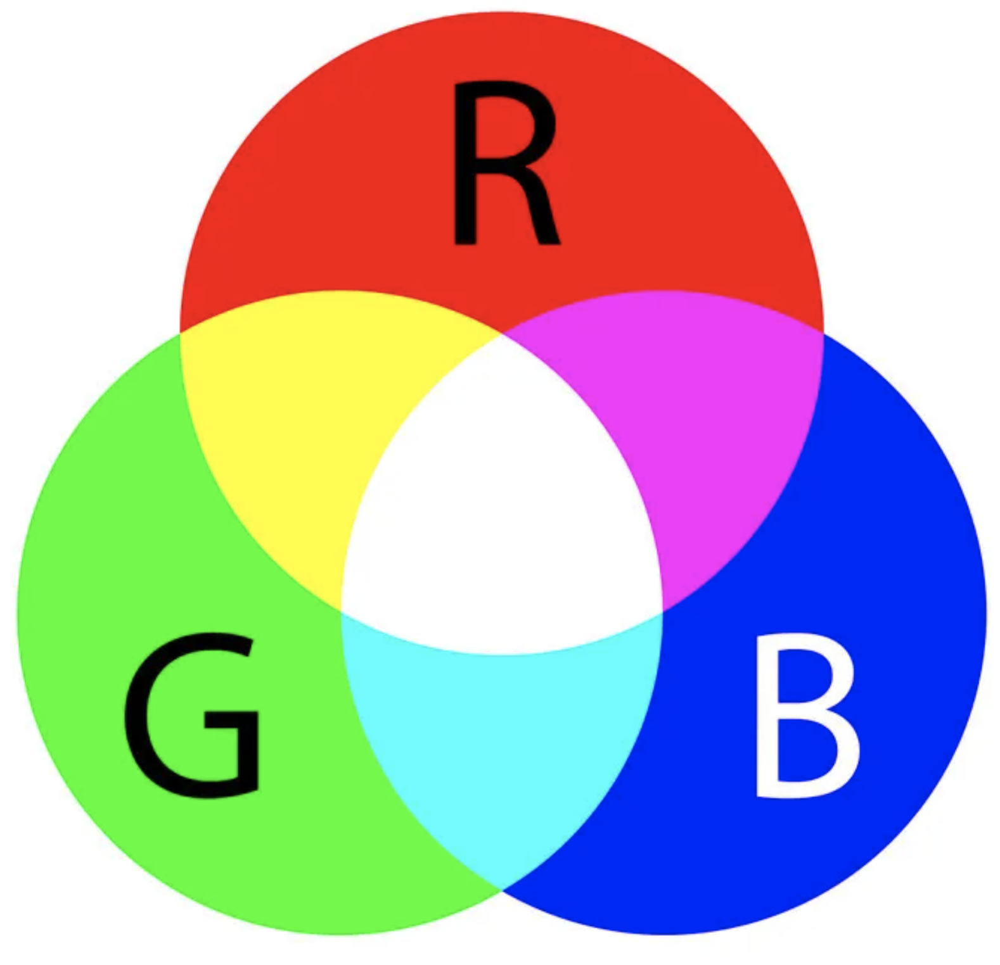
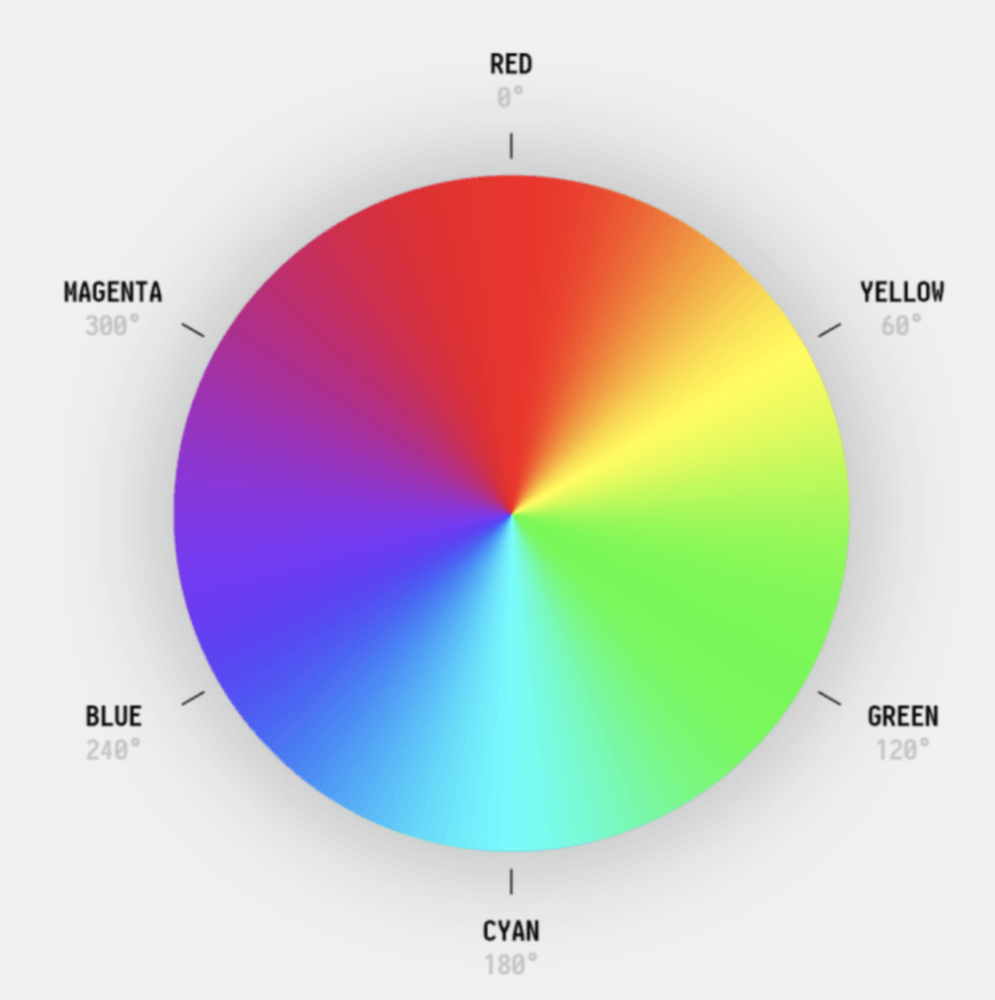
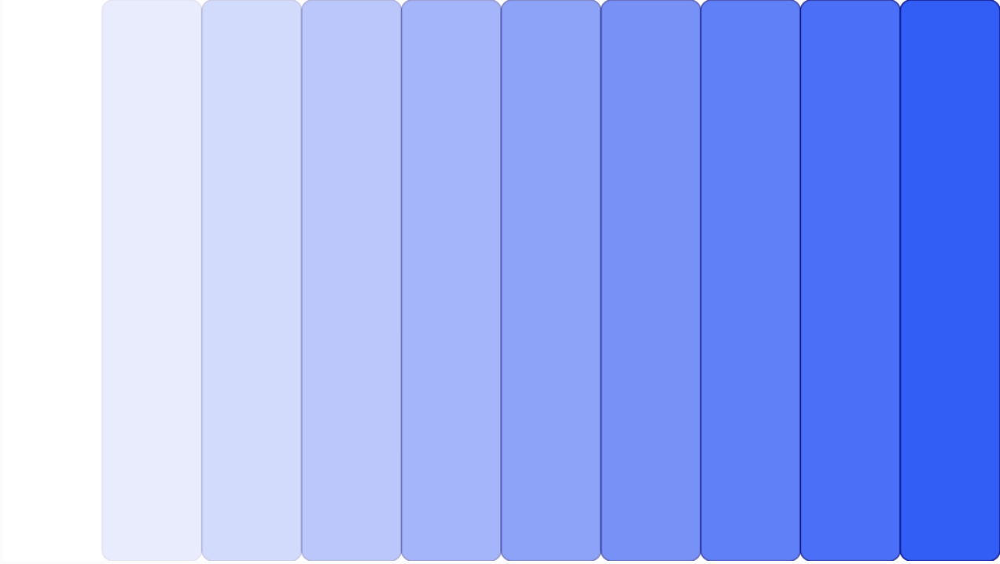
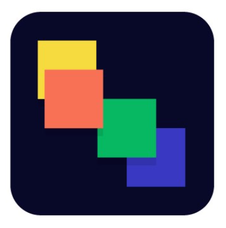
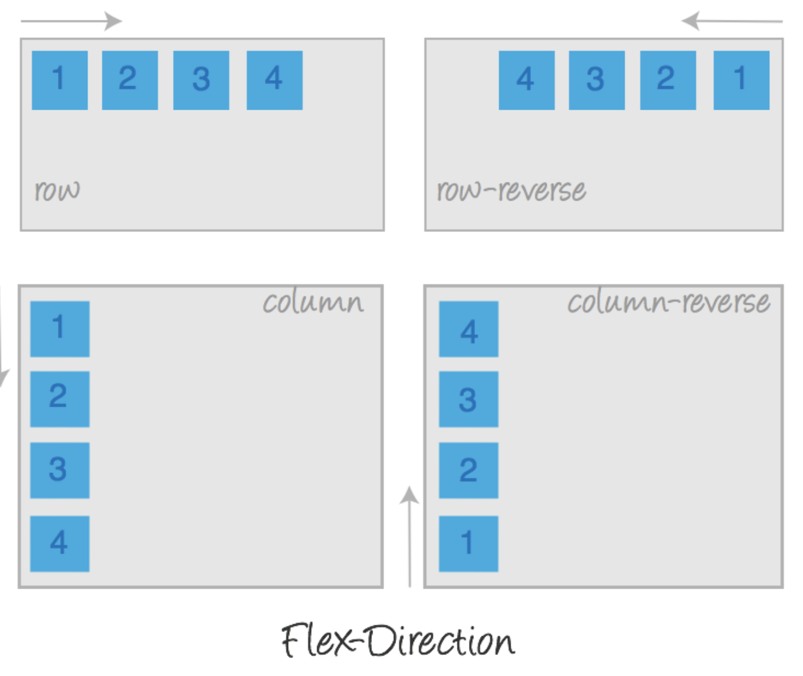
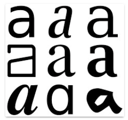
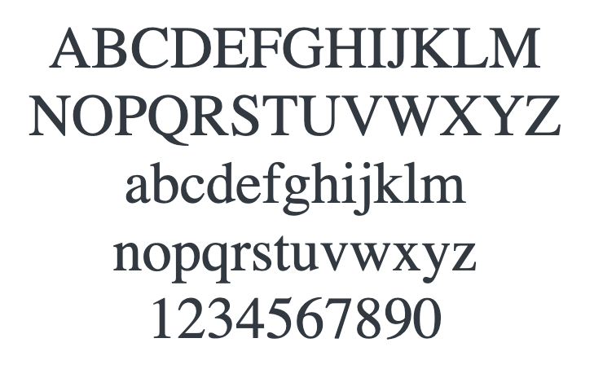
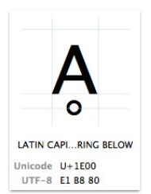
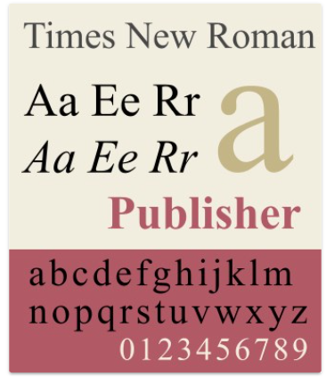

# Lesson 2
## Мои долги за прошлый урок

1. [Валидатор](https://validator.w3.org/)
2. [Селекторы](https://code.tutsplus.com/ru/tutorials/the-30-css-selectors-you-must-memorize--net-16048)

## План
1. [Работа с цветом](#colors)
2. [Псевдоклассы и псевдоэлементы](#pseudo)
3. [Float](#float)
4. [Позиционирование элементов](#positions)
5. [Свойство z-index](#z-index)
6. [Стандарт HTML5](#html5)
7. [Переменные CSS](#css-vars)
8. [Flexbox](#flexbox)
9. [CSS-тени](#css-shadows)
10. [CSS-трансформации](#css-transforms)
11. [Шрифты](#fonts)
12. [Абсолютные и относительные единицы CSS ](#points)
13. [Формы](#forms)
14. [Введение в Responsive веб дизайн](#responsive)
15. [Новые подходы к верстке](#new)
16. [Responsive meta tag](#responsive-tag)
17. [Chrome DevTools](#devtools)
18. [Философия Responsive веб дизайна](#phylosofy)
19. [Правила responsive верстки](#rules)
20. [Медиазапросы (Media Queries)](#queries)

<h2 id="colors">Работа с цветом</h2>

<h3>Введение в теорию цвета</h3>

Существуют цвета, смешивая которые можно получить все остальные цвета и оттенки. Это так называемые __основные цвета__. 
Минимальное количество таких цветов - три. Количество сочетаний основных цветов достаточно много. На практике используют 
только те сочетания, на которые настроена человеческая физиология, человеческий глаз имеет рецепторы для красного, 
зеленого и синего цвета.

Однако не только физиология определяет создание технологии воспроизведения цвета. Также важно и на каком фоне будет 
происходить отображение. Экран монитора - черный. Значит, отсутствие цвета должно давать черный цвет, а максимальное 
смешение цветов - белый. Это __аддитивная модель__ (add - добавлять). Белый лист бумаги при отсутствии цвета даст белый 
цвет, а максимальное смешение цветов - черный. Это __субтрактивная модель__ цвета (subtract - отнимать). В CSS используют 
аддитивную модель, т.к. основное средство отображения это экран.

<h3>RGB</h3>

Основные цвета - __RED__, __GREEN__, __BLUE__.

Допустимые диапазоны:
* __0% - 100%__ процентный
* __0 - 255__ числовой (один байт)

Синтаксис:
* Процентный: rgb(0%, 50%, 100%);
* Числовой: rgb(0, 127, 255);

<h3>Hexadecimal (HEX)</h3>

Это описание цвета основано на 16-ричной записи числа. Для тех, кто не знаком с этой нотацией, необходимо 
предварительно ознакомиться с [Шестнадцатеричной системой счисления](https://ru.wikipedia.org/wiki/%D0%A8%D0%B5%D1%81%D1%82%D0%BD%D0%B0%D0%B4%D1%86%D0%B0%D1%82%D0%B5%D1%80%D0%B8%D1%87%D0%BD%D0%B0%D1%8F_%D1%81%D0%B8%D1%81%D1%82%D0%B5%D0%BC%D0%B0_%D1%81%D1%87%D0%B8%D1%81%D0%BB%D0%B5%D0%BD%D0%B8%D1%8F).

Основные цвета - __RED__, __GREEN__, __BLUE__.

Допустимые диапазоны:
* __0 - f__ числовой, 16-ричный (краткая нотация) 
* __00 - ff__ числовой, 16-ричный (полная нотация)

16-ричный формат содержит символы: 0, 1, 2, 3, 4, 5, 6, 7, 8, 9, a, b, c, d, e, f или 0, 1, 2, 3, 4, 5, 6, 7, 8, 9, A, 
B, C, D, E, F

Синтаксис:
* Краткий: #f32;
* Полный: #ff3322;

<h3>HSL</h3>

Допустимые диапазоны:
* __Hue:__ 0 - 360 цветовой круг
* __Saturation:__ 0% - 100% процентный, насыщенность
* __Lightness:__ 0% - 100% процентный, светлота (или "лёгкость")

<h3>Opacity (alpha-channel)</h3>

__A__ задает уровень непрозрачности для цветовых схем __RGB__ и __HSL__ - __RGBA__ и __HSLA__. 

Допустимые диапазоны: дробные числа между 0 и 1

<h3>Color name</h3>

Так же у нас есть вариант обозначать цвета используя ключевые слова (black, white, red, etc.). 
Вот [тут](https://drafts.csswg.org/css-color/#typedef-named-color) можно ознакомиться со списком поддерживаемых 
ключевых слов.

    Обозначения цвета словами это наиболее ресурсоемкая операция по сравнению с другими цветовыми моделями. 
    Учитывайте это в ситуациях, требующих максимальной скорости работы приложения.

<h2 id="pseudo">Псевдоклассы и псевдоэлементы</h2>

<h3>Псевдоэлементы</h3>

Псевдоэлементы __::before__ и __::after__ позволяют обходиться без создания в коде HTML тегов, не содержащих контент, а 
служащих только для оформления. Например, можно стилизовать список, не изменяя HTML верстку.

Некоторым элементам невозможно присвоить класс или идентификатор, например первой строке или символу блока, 
изменяющего свою ширину. Псевдоэлементы __first-line__ и __first-letter__ решают подобную задачу.

Некоторые элементы имеют такое положение среди других элементов, которое требует изменить их вид, например первый,
последний или n-й элемент списка. Псевдоклассы для выделения потомков или соседей, 
подобные __:first-child__ или __:nth-child__ помогают создавать селекторы положения.

<h3>Псевдоклассы состояния</h3>

1. Динамические псевдоклассы:

* :link — не посещенная ссылка;

* :visited — посещенная ссылка;

* :focus — ссылки, а также элементы форм, которые активированы посредством курсора мыши или на которые перешли с 
помощью клавиатуры (кнопка TAB);

* :hover — ссылки, а также другие элементы, стили применяются при наведении пользователем на элемент;

* :active — выбирает элемент, активированный пользователем с помощью клика мышки. Обычно применяется для ссылок, 
но может отбирать и другие элементы на странице.

2. Псевдоклассы пользовательского интерфейса

* :disabled — используется для отбора и стилизации заблокированных для выбора и изменения элементов форм;

* :enabled — отбирает не заблокированные для выбора и изменения элементы форм;

* :checked — применяется для выбора и стилизации элементов <input type="radio">, <input type="checkbox">, а 
также элементов <option></option>, находящихся внутри элемента <select></select>;

3. Структурные псевдоклассы
* :root :first-child :last-child :first-of-type :last-of-type
* :nth-child() -
* :nth-last-child()
* :nth-of-type()
* :nth-last-of-type()
* :only-of-type :only-child

<h3>Приоритет селектора псевдоэлемента, псевдокласса</h3>

1. Псевдокласс имеет такой же разряд приоритета селектора, как и класс.
2. Псевдоэлемент имеет такой же разряд приоритета селектора, как и элемент.
3. Класс и псевдокласс имеет разряд приоритета выше элемента и псевдоэлемента.
4. Внутри одного разряда приоритет определяется числом селекторов.
5. Селектор с большим разрядом имеет приоритет выше любой суммы селекторов разряда ниже.
6. При равном приоритете селекторов применятся правило, записанное последним.

[Дополнительно про :before и :after](https://habrahabr.ru/post/154319/)

<h2 id="float">Float</h2>

__Обтекание__ - один из самых первых способов размещения контента на веб-страницах. Используется для того чтобы текст
обтекал изображение (отсюда и название). Ранее был одним из основных способов создания макетов в 2 или 3 колонки.
Представляет интерес только в случае работы со старым кодом из-за побочных эффектов и необходимости зачистки после
применения. Применяется к блочным элементам.

Если свойство __float__ применяется к строчному элементу, то этому элементу автоматически присваивается __display:block__. 
Это значит, что ширина элемента теперь зависит не от контента, а от свойства __width__. 
Не задав размеры элементу можно получить нежелательное поведение элемента

* __float: left__ - элемент смещается максимально влево и вверх контейнера, перекрытие других элементов 
со свойством float не допускается

* __float: right__ - элемент смещается максимально вправо и вверх контейнера, перекрытие других элементов со 
свойством float не допускается

* __float: none__ - значение по умолчанию для всех элементов, отмена действия свойства float

<h2 id="positions">Позиционирование элементов</h2>  

Браузер отображает на странице содержимое документа html, следуя потоку выполнения документа. Для европейских 
языков поток выполнения такой же, как правила чтения - сверху вниз, слева направо.

А как будет, если элемент расположен над границей двух блоков? Или как заставить меню оставаться всегда на одном 
месте страницы, в то время как остальное содержимое можно перемещать с помощью скролла? Именно для решения подобных 
задач было создано свойство __position__.

Это свойство может словно приподнять элемент над потоком выполнения и разместить элемент над любым элементом, 
находящимся в потоке. А что будет если два таких элемента вне потока окажутся в одном месте, кто будет в тени, 
а кто на вершине? Эту проблему решает другое свойство - __z-index__.

<h3>Относительное позиционирование</h3>

При __position: relative__, элемент остается в потоке: его размеры и положение рассчитываются для всех соседних 
блоков согласно __box-model__. Прорисовка изображения производится браузером с учетом заданный свойств __top__, __left__,
__bottom__ или __right__. При этом может происходить перекрытие изображения соседних элементов.

<h3>Абсолютное позиционирование</h3>

__position: absolute__ - поднимает элемент над потоком, т.е. после применения этого свойства соседние элементы исключат
этот элемент из расчета для определения своего положения.

Отсчет своих top, left, bottom или right для absolute-элемента ведется относительно ближайшего предка со свойством,
отличным от свойства __position: static__. Если такового предка не окажется, то отсчет будет произведен от __body__.

Свойство __transform__ и его значение __translate(translateX, translateY)__
смещают элемент от его текущего положения. __translateX__ cмещает верхний левый угол элемента по горизонтали, а 
__translateY__ - по вертикали. Т.е. расчет положения такой же, как и в __box-model__. Такое дублирование способа 
перемещения нужно потому, что с помощью свойства можно осуществлять анимацию, о чем подробно будет рассказано позже.

<h3>Позиционирование с фиксацией положения</h3>

__position:fixed__ это аналог значения __absolute__. Отличие заключается в точке отсчета. Для fixed отсчет всегда
ведется от границ окна браузера. Это создает эффект фиксации элемента при использовании вертикальной прокрутки. 
Как правило, свойство position: fixed используют для элементов навигации, позволяющих перейти к началу страницы, 
или для верхнего меню.

<h3>"Липкое" позиционирование</h3>

__position: sticky__ это комбинация свойств __relative__ и __fixed__. Пока элемент находится в своем контейнере 
и контейнер не покидает область экрана при вертикальной прокрутке это __relative__. Если часть родительского 
контейнера покинула видимую часть экрана, то свойство меняется на __fixed__, т.е. фиксируется на странице пока 
часть контейнера присутствует на экране. Если весь контейнер покинет область видимости, то опять включится свойство
__relative__, т.е. изображение элемента исчезнет с экрана вслед за контейнером.

<h3>Отмена действия позиционирования</h3>

__position: static__ - это обычное (по умолчанию) значение свойства position всех элементов. Его можно изменить, 
задав другое значение. А затем отменить действие _relative_, _absolute_
или _fixed_ присвоив снова значение __static__.

<h2 id="z-index">Свойство z-index</h2>

До свойства __position__ мы не придавали большого значения расположению элементов по оси z (перпендикуляру к 
плоскости экрана). Расположение элементов в этой плоскости было интуитивно понятно. Предок располагался внизу,
подобно листу бумаги, а потомок - словно новый лист бумаги, который ложится сверху. И чем больше потомков было у 
элемента, тем больше было таких слоев.

Но применение __position__ все изменило. В отличие от элементов float, которые выпадают из потока, но не перекрывают
друг друга, элементы с __position__, отличном от
__static__, ведут себя по другому. Элементы выпадают из потока, а значит для таких элементов нужно правило, которое
будет определять какой элемент находится выше, а какой ниже. Это правило задает свойство __z-index__, 
значениями которого может быть любое целое число, в том числе и отрицательное.

<h2 id="html5">Стандарт HTML5</h2>

__Cемантическая верстка__ предназначена для описания смысловой структуры документа. А именно для разделения контента 
на различные по типу и содержанию части: заголовки, абзацы, изображения, ссылки и т.п.

До HTML5 часть тегов несла минимальную смысловую нагрузку "контейнер" - div и span . А часть тегов вообще имела 
отношение не к содержанию, а к внешнему виду - br, hr, i, b и т.п. HTML5 предоставил новые элементы для 
структурирования и группировки контента, способных передать семантику блока. Например, __header__ и __footer__.

С практической точки зрения подобные изменения облегчают анализ содержимого веб-страниц поисковыми роботами, 
программам для людей с ограниченными возможностями и т.п.

Всего выделяют 7 групп элементов, по смысловому содержанию:

1. Мета содержимое
2. Потоковое содержимое 
3. Секционное содержимое
4. Заголовочное содержимое 
5. Текстовое содержимое
6. Встроенное содержимое
7. Интерактивное содержимое

<h3>Cтруктурные элементы</h3>

В то время как __div__ может использоваться для представления нижеперечисленных разделов, 
использование семантичных элементов обеспечивает гораздо более богатый и значимый документ.

<h4>header</h4>

Заголовок страницы или раздела, содержащий вводный контент или навигацию. Не является обязательным.В HTML-документе может содержаться одновременно несколько элементов header и они могут располагаться в любой части страницы.

    header нельзя помещать внутрь элементов footer, address, header.

<h4>nav</h4>

Предназначен для создания блока навигации веб-страницы или всего веб-сайта. Блок навигации - основная группа 
ссылок на другие страницы или разделы страницы. На странице может быть несколько элементов. Не заменяет 
теги __ul__ или __ol__, он просто их обрамляет, тем самым придавая семантическое значение.

<h4>article</h4>

Раздел, целиком содержащий некоторую тему - "независимая часть документа или сайта". Используется для группировки
записей — публикаций, статей, записей блога. Как правило, начинается с заголовка

<h4>section</h4>

Общий раздел документа. Может использоваться для разделения статьи или, например, для представления глав. Это 
универсальный раздел документа. Группирует тематическое содержимое и обычно содержит заголовок.

<h4>main</h4>

Основное содержание body - уникальное для страницы, исключая контент, который может повторяться на нескольких страницах, например, навигация

<h4>aside</h4>

Группирует содержимое, связанное с окружающим его контентом. Раздел, располагающийся сбоку от основного, содержит
менее значимую информацию (рекламные блоки, архив и т.п.)

<h4>footer</h4>

Нижний колонтитул страницы или раздела. Может содержать контент, например, постскриптум, приложение 
или ссылки на связанные страницы, данные о копирайте, контактную информацию

    В документе может быть несколько элементов footer . Как каждая страница, так и каждая статья может иметь свой footer .

<h4>figure и figcaption</h4>

Автономный иллюстративный контент, который обычно упоминается в основном содержании страницы. Используется для 
добавления описания к фотографиям, диаграммам, фрагментам кода. __figcaption__ — потомок __figure__. Используется 
как контейнер для содержания описательной части изображения.

<h3>Элементы семантики текста</h3>

* __address__ - для отображения контактных данных владельца документа или статьи
* __time__ - определяет время или дату. Для тега доступен атрибут datetime, его значение будет видеть пользователь на экране своего компьютера.
* __mark__ - выделяет фрагменты текста, помечая их желтым фоном, обычно при совпадении с текстом в строке поиска.
* __small__ - комментарии - отображает текст шрифтом меньшего размера
* __cite__ - для указания источника цитирования.
* __wbr__ - возможное место разрыва длинной строки
* __bdi, bdo__ - для текста, написанного на языке с потоком отличным от потока документа 
* __ruby, rb, rt, rtc, rp__ - для работы с восточными языками(иероглифами)

<h2 id="css-vars">Переменные CSS</h2>

Для объявления переменной перед свойством достаточно указать два дефиса, а для использования вместо значения 
написать __var()__ и внутри круглых скобок поместить имя переменной с двумя дефисами впереди.

    element { ‐‐main‐bg‐color: violet; }

    element { background-color: var(00main-bg-color); }

<h2 id="flexbox"> Flexbox </h2>

В настоящий момент наиболее популярной технологией позиционирования элементов является __Flexbox__. 
У Flexbox хорошая поддержка браузерами и на сегодняшний день это стандарт.

Идея технологии состоит в том, чтобы разделить элементы на блок-контейнер и управляемые элементы - непосредственные 
потомки контейнера. Блок-контейнер задает общий вид и направление группировки элементов (выравнивание в колонку или 
ряд, порядок появления элементов и расстояние между ними), а элементы имеют возможность задавать уникальные 
характеристики (встать на позицию другого элемента, изменив заданный в html порядок). Для осуществления такой 
гибкости в технологию введены новые абстракции - направления, вдоль которых выстраиваются элементы, линии границ 
блоков и элементов и т.п.

[Игра-тренажер по флексам](https://flexboxfroggy.com/#ru).
[Шпаргалка](https://fls.guru/flexbox.html)

<h3> Свойства flex-контейнера </h3>

| Свойство | Значение | Поведение |
|----------|----------|-----------|
| display | flex  |  задает flex-контейнер c элементами block |
| display | inline-flex   |задает flex-контейнер c элементами inline-block   |

<h4> Axis </h4>

Элементы flex всегда располагаются вдоль главной оси. При этом главная ось может быть расположена горизонтально (row)
или вертикально (column).

* Главная ось всегда перпендикулярна вспомогательной оси. 
* Направление главной оси можно изменить.
* Порядок расположения элементов вдоль главной оси можно изменить. 
* Это не повлияет на направление вспомогательной оси.

<h4> flex-direction </h4>

| Свойство       | Значение | Поведение                                             |
|----------------|----------|-------------------------------------------------------|
| flex-direction | row (default)  | задает горизонтальный порядок элементов слева направо |
| flex-direction        | row-reverse   | задает горизонтальный порядок элементов справа налево |
| flex-direction        | column   | задает вертикальный порядок элементов сверху вниз|
| flex-direction        | column-reverse   | задает вертикальный порядок элементов снизу вверх       |

<h4> Flex-wrap </h4>

| Свойство       | Значение       | Поведение                                             |
|----------------|----------------|-------------------------------------------------------|
| flex-wrap      | none (default) | запрещает перенос элементов из основной оси |
| flex-wrap      | wrap           | разрешает перенос элементов из основной оси на новую строку |
| flex-wrap      | wrap-reverse   | разрешает перенос элементов из основной оси на новую строку (обратный порядок строк)|

    flex-flow
    это краткая форма записи flex-direction и flex-wrap , например
    flex-flow: column wrap;

<h4> justify-content </h4>

| Свойство       | Значение       | Поведение                                             |
|----------------|----------------|-------------------------------------------------------|
| justify      | flex-start (default) | элементы выравниваются от начала главной оси|
| justify      | flex-end  | элементы выравниваются от конца главной оси|
| justify      | center | элементы выравниваются по центру главной оси|
| justify      | space- around| элементы выравниваются по главной оси, расстояние между каждой парой смежных элементов одинаково. Края сливаются с границей первого и последнего элемента.|
| justify      | space- between  | элементы выравниваются по главной оси, расстояние между каждой парой смежных элементов одинаково. Отступ по краям равен половине интервала между каждой парой смежных элементов.|
| justify      | space-evenly | элементы выравниваются по главной оси, c равным интервалом, расстояние между каждой парой смежных элементов и краями одинаково.|

<h4> cross axis </h4>

Дополнительная ось, всегда перпендикулярная основной оси. Особое поведение cross axis состоит в том, что эта ось 
не меняет свое направление при смене направления главной оси.

| Свойство       | Значение       | Поведение                                             |
|----------------|----------------|-------------------------------------------------------|
| align-items      | stretch | Значение по умолчанию. Элементы растягиваются так, чтобы занять всю высоту строки|
| align-items      | flex-start  | элементы выравниваются от начала cross axis|
| align-items      | flex-end | элементы выравниваются от конца cross axis|
| align-items      | center| элементы выравниваются по центру cross axis|
| align-items      | baseline  | элементы выравниваются по baseline текста, расположенного в элементах|

<h4> align-content </h4>

Это свойство работает только, если главная ось состоит из более чем одной строки. Другими словами, 
если __flex-wrap: wrap__ или __flex-wrap: wrap-reverse__ привели к переносу строк.

Положение строк вдоль cross axis

| Свойство       | Значение      | Поведение                                                                             |
|----------------|---------------|---------------------------------------------------------------------------------------|
| align-content      | stretch       | Значение по умолчанию. Строки растягиваются так, чтобы занять всю площадь cross axis  |
| align-content      | flex-start    | строки выравниваются от начала cross axis |
| align-content      | flex-end      | строки выравниваются от конца cross axis |
| align-content      | center        | строки выравниваются по центру cross axis |
| align-content      | space-between | строки выравниваются вдоль cross axis так, чтобы крайние строки прижимались к краям, а свободное место распределялось равными частями между собой. |
| align-content      | space-around  | строки выравниваются вдоль cross axis так, чтобы свободное место распределялось равными частями между собой, а крайние строки имели расстояние к краям равным половине от межстрочного расстояния. |

<h3> Свойства flex-элемента </h3>

[Полный гайд с более детальными объяснениями](https://css-tricks.com/snippets/css/a-guide-to-flexbox/)

<h4> order </h4>

Это возможность управления положением отдельного элемента. Элементы располагаются в порядке возрастания значения __order__.
При равенстве значения order порядок задается последовательностью расположения элементов в HTML. По умолчанию 
у всех элементов __order: 0__.

<h4> flex-grow </h4>

Определят пропорцию значения width элемента flex контейнера, которая будет рассчитана 
за счет удаления свободного пространства. По умолчанию это значение для всех элементов равно __0__. 
Отрицательные значения не поддерживаются.

<h4> flex-shrink </h4>

Определят пропорцию значения width элемента flex контейнера, которая будет рассчитана за счет ширины других 
элементов (т.е. при отсутствии свободного пространства). По умолчанию это значение для всех элементов равно 1. 
Отрицательные значения не поддерживаются.

<h4>flex-basis</h4>

Определяет ширину элемента до применения flex-grow и flex-shrink . Т.е. до распределения пространства flex-контейнера.
Допустимы стандартные значения размеров в px, rem, % и т.п. Ожидается поддержка дополнительных значений этого свойства: content, max-content, min-content, fit-content и т.п.

<h4>flex</h4>

Краткая форма записи для перечисленных выше __flex-grow, flex-shrink, flex-basis__.
Обязательным для объявления является только __flex-grow__.

<h2 id="css-shadows"> CSS-тени</h2>

<h3> text-shadow </h3>

Свойство text-shadow используется для добавления тени к тексту. Тень текста позволяет создавать удивительные эффекты.
Тени могут быть однослойными или многослойными, размытыми, цветными или полупрозрачными.

Каждая тень применяется как к самому тексту, так и к элементам его оформления. Одновременно можно задавать несколько
теней, указывая их через запятую. Тени накладываются друг на друга, не перекрывая сам текст. Первая тень всегда
расположена сверху над остальными тенями. Свойство text-shadow наследуется.

Каждая тень определяется двумя или тремя значениями и цветом. Если цвет тени не указан, используется цвет текста.

    text‐shadow: x‐offset y‐offset blur color;

* __x-offset__ - смещение тени по горизонтали относительно текста. Может принимать как
положительные, так и отрицательные значения. Обязательное значение.

* __y-offset__ - смещение тени по вертикали относительно текста. Может принимать как
положительные, так и отрицательные значения. Обязательное значение.

* __blur__ - определяет радиус размытия тени. Чем больше радиус, тем сильнее размыта тень.
Необязательное значение.

* __color__ - по умолчанию принимает цвет текста. Для значения можно использовать hex,
rgb, rgba форматы записи цвета. Необязательное значение

<h3> box-shadow </h3>

Свойство __box-shadow__ добавляет элементу одну или более теней. Тени бывают внешние или внутренние, размытые или плоские,
они могут следовать контурам блоков со скругленными углами. С помощью ключевого слова inset создаются тени внутри элемента,
делая элемент визуально объёмным или вдавленным.

Каждая тень принимает от одного до пяти параметров:

    box‐shadow: inset x‐offset y‐offset blur spread color;
* __x-offset__ - смещение тени по горизонтали относительно блока. Может принимать как положительные, так и отрицательные значения, положительное смещает тень вправо от блока, отрицательное – влево. Обязательное значение.
* __y-offset__ - смещение тени по вертикали относительно блока. Может принимать как положительные, так и отрицательные значения, положительное смещает тень вниз, отрицательное — вверх. Обязательное значение.
* __blur__ - определяет радиус размытия тени. Чем больше радиус, тем сильнее размыта тень. Можно использовать только положительные значения. Необязательное значение.
* __spread__ - расширяет тень, утолщая ее. Принимает как положительные, так и отрицательные значения. Необязательное значение.
* __color__ - Необязательное значение. По умолчанию тень черного цвета. Для установления значения можно использовать hex, rgb, rgba форматы записи цвета.
* __inset__ - создаёт тень внутри блока.

<h2 id="css-transforms"> CSS-трансформации </h2> 

CSS-трансформации позволяют изменять размер, форму и положение элемента на веб-странице с помощью свойства __transform__.

Трансформации преобразовывают элемент так, что другие элементы не сдвигаются относительно него. 
По умолчанию трансформация происходит относительно центра элемента.

Наиболее часто используют краткую форму записи. Краткая форма эквивалентна записи в скобках - где изменяется 
горизонтальная и вертикальная координаты.

<h3> Translate </h3>

Перемещает элемент в горизонтальном и/или вертикальном направлениях

    translate (translateX, translateY), translate3d, translateZ

<h3> Translate </h3>

Перемещает элемент в горизонтальном и/или вертикальном направлениях

    translate (translateX, translateY), translate3d, translateZ

<h3> Rotate </h3>

Вращение вдоль оси X, Y или Z. Вращение вдоль оси X, Y выглядит как сжатие изображения, а вдоль Z - как вращения.

    rotate(rotateX, rotateY), rotate3d, rotateZ

<h3> Scale </h3>

Изменение масштаба элемента. Может перекрывать отображение соседних элементов.

    scale(scaleX, scaleY), scale3d, scaleZ

<h3> Skew </h3>

Используется для искажения сторон элемента относительно координатных осей. Если указано одно значение, второе будет определено браузером автоматически

    scale(scaleX, scaleY), scale3d, scaleZ

<h3> transform-origin </h3>

Позволяет сместить центр трансформации, относительно которого происходит изменение положения/размера/формы элемента. 
Значение по умолчанию — __center__ , или __50% 50%__ . Задаётся только для трансформированных элементов. Не наследуется.

<h2 id="fonts"> Шрифты </h2>

Существует __понятие__ символа и __графического отображения__ символа, которое называется __глиф__. 
Например, символу "смайлик" соответствует глиф ☺. Иногда изображения (глифы) разных символов могут совпадать, как в 
случае символа английской и кириллической буквы __A__. Обычно один символ имеет целый набор глифов - для строчного и заглавного отображения, для имитации машинописи и рукописи.

Набор глифов (изображений символов) одного стиля и их сочетаний называют шрифтом - __font face__.

<h3>Unicode </h3>

Все известные человечеству символы (символы языков, математические знаки, карточные символы, обозначения планет и т.д.
и т.п.) собраны и описаны стандартом, называемым Unicode. В этом стандарте каждый символ имеет официальное именование 
(например, «latin capital letter a») и код (code point) — число от 0 до 10FFFF.

<h3> UTF </h3>

Информация в сети, в том числе и глобальной сети internet, передается в бинарном виде (т.е. может быть описана только в виде 0 или 1).

__UTF (Unicode Transformation format)__ - это способ кодирования нулей и единиц так, чтобы любой компьютер смог узнать
какой именно код Юникода (code point) содержится в наборе из 8-ми (UTF-8), 16-ти (UTF-16) или 32-х (UTF-32) бит.

| Character     | Encoding      | bits                                |
|---------------|---------------|-------------------------------------|
| A             | UTF-8         | 01000001                            |
| A             | UTF-16        | 00000000 01000001                   |
| A             | UTF-32         | 00000000 00000000 00000000 01000001 |

UTF мы обязаны указать в __meta charset__, чтобы браузер понимал сколько бит нужно собрать в группу (как правило, 8), 
чтобы прочесть код юникода на этой странице. Когда браузер прочтет последовательность 0 и 1 как наборы символов Юникода
правильно, то браузеру понадобится найти полученному символу подходящий глиф. Глифы не хранятся отдельно, а собраны в 
шрифты. И это означает, что браузер должен выбрать шрифт.

Подробнее про кодировки символов можно посмотреть [здесь](https://kunststube.net/encoding/).

<h3>Семейства шрифтов </h3>

Шрифты собраны в семейства. По умолчанию, если никакой другой шрифт не задан,
браузер использует шрифт из семейства sans - "Times New Roman".

Если сообщить браузеру, что мы хотим шрифт из другого семейства, например из семейства шрифтов без засечек - sans-serif, то браузер подключит и такой шрифт. Но какой именно это будет шрифт - мы предугадать не сможем. Потому браузер обратится к операционной системе пользователя и попросит ОС предоставить шрифт выбранного семейства.

Mac, Linux и Windows содержат семейства шрифтов, совпадающих с семействами браузера: sans, sans-serif, fantasy, cursive и system-ui. ОС обязательно имеет в каждом семействе шрифт, выбранный шрифтом по умолчанию. Именно его - шрифт по умолчанию, и получит браузер, когда укажет семейство. И хотя известно, какие шрифты предустановлены в системе, добавление и выбор шрифта по умолчанию остается за пользователем.
Миллионы сайтов с одним шрифтом "Times New Roman" были бы, наверное, слишком скучны, а также их трудно было бы выделить и запомнить. Поэтому дизайнеры трудятся, создавая шрифты, а разработчики браузеров в свою очередь, добавили в CSS возможность эти шрифты подключать.

<h4> Поиск шрифта и подключение к селектору </h4>

Для того чтобы некоторому селектору задать шрифт или семейство шрифтов применяют CSS-свойство __font-family__. Синтаксис свойства позволяет указать через запятую не один шрифт, а перечислить несколько шрифтов и задать семейство шрифтов. При этом отображаться будет первый шрифт, который браузер сможет получить от ОС. Порядок поиска соответствует потоку выполнения - браузер будет считывать слева направо содержимое перечисления.

Рассмотрим следующую запись:

    element {
     font-family: Robotot, Verdana, sans-serif;
    }

<h4>Подключение шрифта, отсутствующего в ОС </h4>

Пользователям пришлось бы устанавливать шрифты в систему каждый раз, когда разработчик сайта применил несистемный шрифт. Избавить от этой проблемы помогут
__директивы__ CSS __@font-face или @import__, также можно использовать HTML тег подключения внешних ресурсов link . С помощью этих средств браузер имеет возможность подключать шрифт независимо от ОС из внешнего источника: файла или сетевого ресурса.

Рассмотрим пример подключения.

    p {
        font‐family: "Web font", Helvetica, Tahoma, sans‐serif;
    }
    @font‐face {
        font‐family: 'Web font';
        src: url('webfont.woff2') format('woff2'),
        url('webfont.ttf') format('truetype'), /* Только если нужна поддержка старых бразуеров*/
        url('webfont.woff') format('woff'); font‐weight: normal;
        font‐style: normal; }

<h3>Размещение подключаемого шрифта </h3>

Существует два основных способа разместить подключаемый шрифт - использовать место на том же сервере где хранится сайт или использовать удаленное подключение, т.е. шрифты будут находиться на других серверах, не связанных с доменным именем сайта.

Использование удаленного подключения с серверов службы CDN или Google Fonts позволяет обходить ограничение браузера на количество обращений к одному серверу. Высокая скорость доступа к платным сервисам CDN обеспечит быструю загрузку. В то же время загрузка с локального сайта может оказаться предпочтительной, если количество обращений к серверу не вилико.

Для оценки выбора того или иного способа подключения необходимо изучить скорость загрузки сайта с помощью встроенных инструментов панели разработчика (Ctrl+Shft+E или F12 и вкладка Network).

<h2 id="points">Абсолютные и относительные единицы CSS </h2>

Заботу о связи пиксела CSS и физического пиксела берет на себя операционная система. Разработчик браузерного приложения может воспринимать CSS пиксель как наименьший элемент, который браузер способен отобразить.

При масштабе браузера в 100%, один CSS-пиксель точно равен одному пикселю устройства. Если масштаб изменяется, то браузер делает пересчет размера пикселя, а не их количества. На практике это приводит к тому, что 5 пикселей при уменьшении масштаба в два раза (zoom 50%) изменят свои размеры до 2,5 пикселей и браузер вынужден будет округлить это значение до 3px. В результате размер элемента изменится - к размерам добавится 1 пиксель и это может разрушить верстку (элемент может перескочить на другой ряд).

Чтобы избежать подобной проблемы были созданы относительные величины. Браузер при расчете в относительных единицах сохранит пропорции так, что лишний пиксель не сможет появиться. Проблемой остается свойство border, т.к. только этому свойству box- model нельзя задать относительный размер.

<h3> Абсолютные: px mm, cm, pt, pc</h3>

Здесь все просто - надо использовать px , кроме случая верстки страницы для печатного устройства (например, какие-либо бланки). Тогда уместно использовать pt (типографский пункт) или pc (типографская пика). Единицы cm и mm присутствуют в стандарте только для поддержки старых сайтов.

Формулы перерасчета CSS пикселей (не путать с физическими пикселями):

| unit | px    | 
|------|-------|
| 1mm  | 3.8px |
| 1cm  | 38px  |
| 1pt  | 4/3px |
| 1pc  | 16px  |

<h3> Относительные: %, em и rem, vh и vw</h3>

Использование em слишком сложно - это свойство использует для расчета своей величины размер шрифта родительского контейнера, что затрудняет модификацию и поддержку кода. Величина vw плохо поддерживается браузерами. Поэтому наиболее используемые - это %, rem и vh. Рассмотрим их подробнее.

<h4>%</h4>

Нужно всегда выяснять от какого значения будет вычисляться размер. Наиболее трудным является вычисление высоты в box-model

| Чтобы получить величину в % для | за основу вычисления надо взять ...  | 
|------|-------|
| height  | height родительского контейнера |
| padding и margin  | width родительского контейнера  |
| border  | не использует % |

<h4>rem</h4>

Только размер шрифта, заданный в теге __html__ может изменить значения __rem__. По
умолчанию браузер устанавливает величину шрифта в __16px__ (хотя это может изменить пользователь). Поэтому при использовании __rem__ обязательно укажите размер шрифта в
html явно. При использовании на странице rem не наследуется ни от чего более. Поэтому задав в html фонт размером 20px можно расчитывать, что 2rem будут всегда равны 2 * 20px = 40px .

<h4>vh</h4>

Размер высоты viewport или, проще говоря - 100vh заполнит экран по высоте полностью. Эту особенность данной величины используют в случаях, когда требуется разместить контент на весь экран (например, такой прием часто используют для фотографий на лендинг страницах). Использование меньших размеров этого значения затрудняет тот факт, что неизвестно количество пикселей, оказавшееся в 50vh . Очевидно, что это будет половина экрана. Но это 384px против 512px для высоты экранов 768px и 1024px . Такой разброс не подходит для формирования сложных конструкций.

<h2 id="forms">Формы</h2>

__Формы__ - это инструмент HTML для взаимодействия пользователя с сайтом.

С помощью форм пользователь может вводить какие-либо данные - написать комментарий, выбрать товар и оплатить его с помощью кредитной карты, подобрать подходящий маршрут на карте и т.п.

Все это возможно благодаря тому, что браузер умеет с помощью форм получить данные пользователя и затем обрабатывает эти данные сам либо пересылает данные на обработку серверу.

Когда говорят о веб-формах, подразумевают тег __form__ и связанные с ним теги - __input__, __select__, __label__
и т.д. Название веб-формы они получили из-за того, что тег form
объединяет информацию в группу и подсказывает браузеру, куда эти данные отправить (атрибут action) и каким именно способом осуществить отправку (атрибут __method__).

1. адрес отправки формы (значение свойства action тега form)
2. метод отправки формы(значение свойства method тега form)
3. элементы ввода (input, textarea, select и т.п.)
4. кнопка отправки формы (button или input с атрибутом type="submit")

<h3>Методы передачи данных get и post</h3>

Браузер имеет несколько методов для отправки запроса - этот механизм встроен в теги __\<a>__ и __\__ .
Браузер находит атрибут __href__ или **src**, получает из них строку с **url**,
и обращается по указанному в **url** протоколу к ресурсу локальному или удаленному (через обращение к серверу).

Похожий, но более мощный механизм встроен в теге **form**. Этот механизм не использует готовую строку, подобно строке 
**href** или **src**, а формирует такую строку сам.

Вот порядок, в котором происходит создание строки запроса по протоколу **HTTP**: 
* С помощью атрибута **action** задается адрес, по которому будет передан запрос.

* Далее с помощью атрибута **method** выбирается один из 2-х вариантов HTTP методов - метод **GET** или **POST**. 
Метод GET в браузерах установлен по умолчанию, и его специально задавать нет необходимости. 
Метод POST необходимо задавать, если передаваемые данные содержат конфиденциальную информацию - логин и пароль, например.

* Затем, после специального знака разделителя, в строке следуют пары "**ключ: значение**" .

* Атрибут отправки **submit** запустит проверку заполнения форм и, в случае успеха, закончит формирование строки и передаст ее браузеру.

Если использовать метод **GET**, то вся подготовленная строка будет видна в браузере. Если используется метод **POST**, 
то видна будет только часть строки - т.н. заголовок. Собственно метод GET и есть отправка заголовка запроса, 
без подключения тела сообщения, которое осуществляется в методе **POST**.

    При верстке макета в качестве адреса используют # , т.к. хэш адресует запрос на эту же 
    страницу. Т.е. # используется временно, до работ, связанных с подключением сайта с бэкендом 
    или до наполнения его контентом

Рассмотрим пример 
    
    <form action="#" method="get">
        <input type="text" name="name" placeholder="value"> <input type="submit" value="submit">
    </form>

<h3> input </h3>

Больше информации [здесь](https://css.in.ua/html/tag/input);

<h3>Select </h3>

Для выбора одного из нескольких вариантов помимо __checkbox__ используется конструкция __select-option__. 
В теге select задается значение name и другие свойства. Каждый из вариантов для выбора задается в теге **option**.

<h3>Textarea</h3>

Для ввода текстовых данных, в которых несколько строчек используется тег textarea

<h3>Placeholder, значение по умолчанию</h3>

В некоторых случаях необходимо указать значение по умолчанию. Для этого в тегах **input** необходимо указать значение 
свойства **value**, для тега **textarea** - поставить значение по умолчанию между тегами, для конструкции **select-option**
свойство **selected** в соответствующем элементе  **option**.

Удобным инструментом является возможность написать подсказку о том, какие данные необходимо вносить в форму. 
Такую подсказку можно реализовать с помощью свойства placeholder. Данное свойство можно указать практически в любом 
элементе формы, где есть текстовый ввод.

Отличием между **placeholder** и **value** c **selected** в том, что при появлении курсора (событие фокус может быть 
осуществлено мышью или клавиатурой - кнопкой **tab**) текст исчезает, а текст **value** придется удалить. 
Т.е. **placeholder** не является значением input

<h2 id="responsive"> Введение в Responsive веб дизайн </h2>

Раньше сайты были с фиксированной версткой. Если сайт был в ширину 800 пикселей — он так и оставался 800 пикселей, 
на каком мониторе его ни открывай, большом или крохотном. Такой подход полностью устарел вместе с табличной версткой.

Потом сайты стали «резиновыми». Если мы меняли размер окна браузера — элементы сжимались или растягивались. Открывали 
на большом мониторе или на маленьком, или на смартфоне — везде сайт выглядел симпатично, менялся только масштаб. Это 
было удобно пользователю и смотрелось красиво. Но и такой подход тоже устарел.

Больше половины трафика в интернете приходится на мобильные телефоны и планшеты. Поэтому создание отзывчивых веб-сайтов
сегодня является обязательным для разработчика интерфейсов.

<h2 id="new">Новые подходы к верстке</h2>

В современном вебе используются новые подходы при создании веб сайтов. Они сочетают в себе элементы «резиновой»
верстки и новые, современные приемы, такие как адаптивность и отзывчивость. 

Термины «адаптивный сайт» и «отзывчивый сайт» (adaptive и responsive) кардинально отличаются. Давайте разберемся, что это такое

<h3> Отзывчивый сайт </h3>

Сайт, который имеет несколько вариантов отображения, переходы между ними плавные, как на «резине». Меняете размер окна — кнопки медленно меняются в размерах, блоки плавно ужимаются, а когда наступает контрольная точка — сайт меняет расположение блоков под планшет или под смартфон.

<h3> Адаптивный сайт </h3>

Сайт, который на мониторе отображается одним образом, на планшете иначе, а на смартфоне — снова по-другому. Меняется расположение блоков, размеры кнопок и полей, текстов. Зачем? Чтобы пользователю было комфортнее пользоваться сайтом: в кнопку легче попадать пальцем, если она крупная, текст в метро легче читать, если он 20 пунктов, а не 14.

<h3> Что лучше? </h3>

Нет однозначного ответа. Отзывчивая верстка определенно дороже, так как делать ее дольше. Иногда достаточно просто «резинового» сайта. Иногда — бизнес-задачи лучше выполнит отдельная мобильная версия. Или вообще приложение вместо сайта. Все больше и больше разработчики склоняются к «отзывчивым» сайтам. Именно этот подход мы и будем рассматривать более подробно.

<h2 id="responsive-tag"> Responsive meta tag </h2>

Страницы, адаптированные для просмотра на разных устройствах, должны содержать в разделе head мета-тег viewport. 
Он сообщает браузеру, каким образом нужно контролировать размеры и масштаб страницы. Добавим в head, кроме всех 
остальных тегов, еще мета-тег вьюпорта.

Таким образом, ширина окна просмотра будет адаптироваться к ширине экрана устройства width=device-width, обеспечивая 
соотношение 1:1 между пикселями CSS и аппаратными пикселями устройства initial-scale=1.0;

<h2 id="devtools"> Chrome DevTools для работы с мобильной версткой</h2>

<h2 id="phylosofy"> Философия Responsive веб дизайна </h2>

Так как веб страницу сейчас можно открыть на множестве устройств и экранов, было необходимо решение проблем отображения контента. Философия отзывчивого веб дизайна построена на нескольких подходах и приемах при верстке. Давайте рассмотрим их подробнее.

<h3>Относительные единицы </h3>

Сайт можно открыть на ПК, мобильном телефоне и т.д., при чем элементы интерфейса должны соблюдать пропорции, задуманые дизайнером. Плотность пикселей также может меняться, поэтому нам нужны единицы, которые гибки и работают повсюду. Вот где нам подходят относительные единицы, такие как проценты. Таким образом, если задать блоку ширину 50%, он всегда будет занимать половину экрана. Так же на помощь приходят rem и em для задания ширин элементов интерфейса и отступов в относительных единицах.

<h2 id="rules">Правила responsive верстки </h2>

<h3> width в %</h3>

Итак, ширины блоков мы задаем не в px, а в процентах. Таким образом, когда макет сжимается на крошечном мобильном устройстве или растягивается через огромный экран, все элементы в макете будут изменять их ширину по отношению друг к другу.

Чтобы рассчитать пропорции для каждого элемента страницы, вы должны разделить целевой элемент на его контекст. В настоящее время лучший способ сделать это - сначала открыть макет в редакторе, таком как Photoshop. Благодаря высокому качеству макета, вы можете измерить элемент страницы и разделить его на всю ширину страницы.

Например, если ваш макет по ширине равен 960 пикселям, тогда это будет ваше «контейнерное» значение. Предположим, что наш целевой элемент - это какое-то произвольное значение, например, 300 пикселей в ширину. Если умножить результат на 100, мы получим процентное значение 31,25%, которое мы можем применить к целевому элементу.

<h3>min и max width </h3>

Важной частью отзывчивого дизайна является использование минимальных/ максимальных ширин контейнеров в пикселях (или rem/em) и ширин в % для контента внутри контейнеров. При responsive верстке не может быть фиксированных ширин в пикселях даже у оберток(дальше контейнер), может быть только максимальная/ минимальная ширина. Это сделано для того чтобы контейнер растягивался на 100% текущей ширины окна браузера, но не растягивался больше чем максимальная ширина указанная в макете.

<h3>margin </h3>

Горизонтальный margin для блоков задается в процентах. Если бы по макету у нас были зазоры между articles и сайдбарами, и допустим articles был бы 46% шириной. Тогда ширины блоков выглядели бы следующим образом.
* articles - 46% 
* left-sidebar - 25% 
* right-sidebar - 25%
* articles левый и правый margin был бы по 2%

Итого занято 100% ширины content. Конечно, если мы используем Flexbox, то достаточно задать justify-content: 
space-between, явно задавать margin не надо. Зазоры между колонками все равно будут по 2%.

<h3> padding</h3>

В отличие от margin, в 99% случаев при responsive верстке, вертикальный и горизонтальный padding задается в rem\em.

<h3> Подведем итоги</h3>

Это отличный подход к созданию отзывчивой веб страницы, но не все так просто. Когда ширина браузера становится слишком узкой, страница может начать сильно искажаться. Например, сложный трехколоночный макет не очень хорошо работает на небольшом мобильном телефоне. К счастью, отзывчивый дизайн позаботился об этой проблеме, используя медиа-запросы, о них позже.

<h2 id="queries"> Медиазапросы (Media Queries)</h2>

**Медиазапросы** — это модуль CSS3, который позволяет создавать отзывчивые веб-сайты, используя различные правила 
стилей для разных устройств или типов носителей. В зависимости от этих правил содержимое отображается в соответствии 
с различными условиями, например размером экрана, окна браузера или самого устройства, а также ориентацией и разрешением устройства.

Не забывайте о том, что горизонтальный margin у блоков задается в % от ширины родителя. В то же время горизонтальный
margin у элементов блока задается в rem. К примеру, блок статей. Если горизонтальный margin между статьями задается 
в %, то margin элементов внутри статьи задается в rem. Это не абсолютное правило, скорее хорошая практика.

В общем случае медиа-запрос состоит из ключевого слова, описывающего тип устройства (необязательный параметр) и 
выражения, проверяющего характеристики данного устройства. Из всех характеристик чаще всего проверяется ширина 
устройства width. Медиа-запрос является логическим выражением, которое возвращает истину или ложь

<h3>Способы добавления медиазапросов</h3>

<h4>В HTML файле</h4>

Создается файл стилей и наполняется css правилами. После чего подключается к странице, используя тег link, к которому добавляется атрибут media. Отметим, что сам файл стилей будет загружен вместе со страницей, не зависимо от ширины экрана устройства. Но стили из него будут применены только при выполнении условий media.

<h4>Внутри таблицы стилей</h4>

Создается файл стилей. Внутри него, используя специальную конструкцию @media, описываются стили для определенных ширин экрана.

современной разработке значительно чаще используется этот метод. Мы прописываем стили элементам интерфейса 
под определенные медиаправила, и они применяются в зависимости от условий.

    @media (rules) - используется для применения стилей на определенных носителях, размерах экрана 
    и т.д. Это позволяет нам указать различные варианты дизайна в зависимости от размера экрана. 
    Затем страницу можно оптимизировать и показывать совершенно по-разному для мобильных телефонов, 
    планшетов и разных размеров окон браузера.

<h3> min-width vs max-width </h3>

Давайте разберемся с min-width и max-width в rules у медиа-запроса.

**@media (min-width: 500px)** - говорит о том, что стили, которые указаны внутри
этого медиа-правила, будут применены при минимальной ширине экрана 500px и шире.

**@media (max-width: 500px)** - говорит о том, что стили, которые указаны внутри этого медиа-правила, будут применены 
от нуля до максимальной ширины экрана в 500px.

<h3> Логические операторы </h3>

Логичным будет вопрос, а что делать, если я хочу чтобы какое-то css-правило применилось только в диапазоне, к 
примеру, от 400px до 800px? Или наоборот, применялось всегда кроме диапазона 400px-800px? Для этого существуют 
логические операторы. Мы рассмотрим самые распространенные.

<h4>Операторы and и not</h4>

* **and** - связывает между собой разные условия. Код ниже сделает так, что левая колонка
будет окрашиваться в желтый цвет в диапазоне 400px - 800px.
* **not** - позволяет сработать медиазапросу в противоположном случае. Ключевое слово not
добавляется в начало медиазапроса и применяется ко всему запросу целиком

<h3>Типы устройств</h3>

Что это за screen? Это один из типов устройств, всего их 4. Этот параметр не является
обязательным и служит для более специфичного применения медиаправила.

| Тип    | Описание                                                                                                                   | 
|--------|----------------------------------------------------------------------------------------------------------------------------|
| all    | Подходит для всех типов устройств                                                                                          |
| print  | Предназначен для страничных материалов и документов, просматриваемых на экране в режиме предварительного просмотра печати. |
| screen | Предназначен, в первую очередь для экранов цветных компьютерных мониторов.                                                 |
| speech | Предназначен для синтезаторов речи.                                                                                        |

<h3>Характеристики носителя </h3>

К характеристикам медианосителя относятся проверяемые параметры устройства. Значения, которые используются при 
задании характеристик, являются контрольными точками. Такие как max-device-aspect-ratio, max-device-width, min-width, 
min-resolution и многие другие.

<h3>Device Orientation </h3>

Если вам необходимо применить CSS в зависимости от ориентации браузера, вам помогут следующие правила. Это может быть
особенно полезно для мобильных устройств.

| ориентация    | правило                                                                    | 
|--------|----------------------------------------------------------------------------|
| Горизонтальная (landscape    | @media screen and (orientation: landscape) {...}                           |
| Вертикальная (portrait)  | @media screen and (orientation: portrait) {...}                                                                          |

<h3>Несколько медиаправил </h3>

Вы можете применить сколько угодно правил @media, поэтому у вас может быть
несколько разных дизайнов (макетов), зависящих от размера экрана.

Итак, алгоритм записи медиаправила:

* Указываем @media и выражение проверки ширины экрана устройства 
* Внутри media указываем css-правило для селектора 
* Внутри css-правила указываем css-свойства и их значения, которые мы хотим применить при этом media

<h3> Как узнать какие прописывать медиаправила</h3>

При составлении медиазапросов нужно ориентироваться на так называемые переломные (контрольные) точки дизайна, т.е. 
акие значения ширины области просмотра, в которых дизайн сайта существенно меняется, например, изменяется положение 
элементов интерфейса. Для верстальщика это те точки, макеты для которых ему предоставили.

Под каждую контрольную точку рисуется отдельный макет. Между контрольными точками, верстка должна быть «резиновой». 
Чтобы адаптировать дизайн сайта под разные устройства, необходимо задать разные стили для разных разрешений экранов, 
используя определённые контрольные точки.

320px Мобильные телефоны с узким экраном
480px Современные смартфоны среднего\высокого уровня 768px Таблетки
960px Таблетки с широким экраном
1200px Ноутбуки
1440px Десктопы

| ширина | устройство                                                     | 
|------|----------------------------------------------------------------|
| 320px | Мобильные телефоны с узким экраном                             |
| 480px | Современные смартфоны среднего\высокого уровня 768px Таблетки  |
| 960px | Таблетки с широким экраном                                     |
| 1200px | Ноутбуки                                                       |
| 1440px | Десктопы                                                       |

